# Veridex — E-Invoicing Platform Architecture

> Complete architecture for a Nigeria-compliant e-invoicing platform built on the **actual NRS (FIRS) Merchant Buyer Solution API**.

---

## 1. System Overview

Veridex is a SaaS e-invoicing platform that enables Nigerian businesses to create, manage, validate, sign, and transmit electronic invoices in compliance with the **Nigeria Revenue Service (NRS)** mandate via the **Merchant Buyer Solution (MBS)** API.

### High-Level Architecture

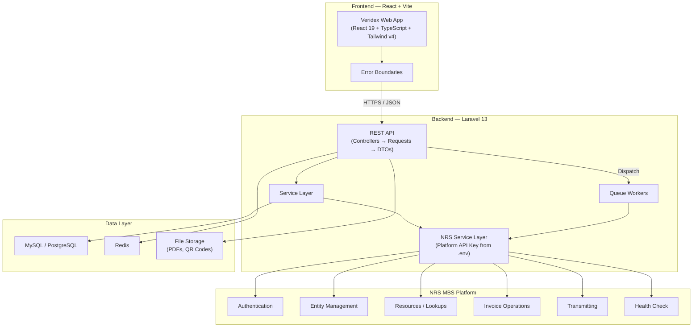

### Request Flow

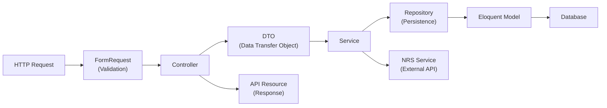

---

## 2. NRS MBS API Reference (From Postman Collection)

### 2.1 Authentication (Platform-Level — MBS Model)

Veridex is registered as a **Merchant Buyer Solution (MBS) provider** with NRS. All API calls use a **single set of platform-level credentials** stored in `.env`:

| Header | Description |
|---|---|
| `x-api-key` | Veridex's platform API Key from NRS |
| `x-api-secret` | Veridex's platform API Secret from NRS |

> [!IMPORTANT]
> **These are Veridex's credentials, NOT per-organization.** NRS issues one API key to the MBS provider. Individual businesses are identified by their `business_id` (UUID) in each invoice payload, not by separate API keys.

The API also supports **Taxpayer Login** for delegated session-based operations:

| Endpoint | Method | Description |
|---|---|---|
| `/api/v1/utilities/authenticate` | `POST` | Authenticate as a specific taxpayer |

```json
{
    "email": "{{TAXPAYER_EMAIL}}",
    "password": "{{TAXPAYER_PASSWORD}}"
}
```

> [!NOTE]
> **Security model:** NRS credentials (`x-api-key`, `x-api-secret`) live **exclusively in `.env`** — never in the database. If the DB is breached, attackers get `business_id` UUIDs (useless without the API key). Credential rotation requires only updating `.env` and restarting the app.
>
> **Dual-format support:** Every endpoint supports both JSON and XML via the `Accept` header. Veridex uses **JSON** as the primary format.

---

### 2.2 Entity Management

| Endpoint | Method | Description |
|---|---|---|
| `/api/v1/entity/{entity_id}` | `GET` | Get a single entity by UUID |
| `/api/v1/entity` | `GET` | Search/list entities (paginated) |

**Search Parameters:** `size`, `page`, `sort_by`, `sort_direction_desc`, `reference`

---

### 2.3 Resources (Code Lookups)

| Endpoint | Method | Returns |
|---|---|---|
| `/api/v1/invoice/resources/countries` | `GET` | Country codes (ISO) |
| `/api/v1/invoice/resources/currencies` | `GET` | Currency codes |
| `/api/v1/invoice/resources/tax-categories` | `GET` | Tax category codes (e.g. `LOCAL_SALES_TAX`) |
| `/api/v1/invoice/resources/payment-means` | `GET` | Payment method codes (e.g. `10`, `43`) |
| `/api/v1/invoice/resources/invoice-types` | `GET` | Invoice type codes (e.g. `396`) |
| `/api/v1/invoice/resources/services-codes` | `GET` | Service classification codes |
| `/api/v1/invoice/resources/hs-codes` | `GET` | HS/product codes |
| `/api/v1/invoice/resources/vat-exemptions` | `GET` | VAT exemption reason codes |

> [!TIP]
> These are **cached locally** in Redis (24h TTL) and refreshed via `SyncNrsResources` scheduled job.

---

### 2.4 Invoice Operations — The Core Lifecycle

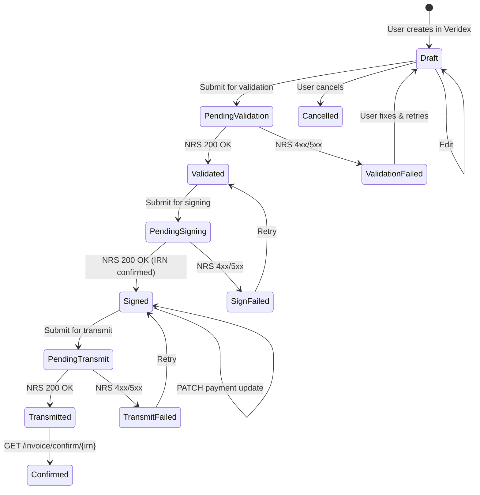

> [!WARNING]
> **NRS will fail.** Network timeouts, validation errors, rate limits, and server errors are common. Every NRS action has a `pending_*` intermediate state and a `*_failed` recovery state. The system must never leave an invoice in a `pending_*` state permanently — failed jobs must resolve to their `*_failed` counterpart.

| Step | Endpoint | Method | Purpose |
|---|---|---|---|
| **Validate** | `/api/v1/invoice/validate` | `POST` | Pre-validate invoice data before signing |
| **Sign** | `/api/v1/invoice/sign` | `POST` | Submit and digitally sign; generates IRN |
| **Transmit** | `/api/v1/invoice/transmit/{irn}` | `POST` | Deliver signed invoice to buyer via NRS |
| **Confirm** | `/api/v1/invoice/confirm/{irn}` | `GET` | Confirm invoice receipt |
| **Validate IRN** | `/api/v1/invoice/irn/validate` | `POST` | Validate an existing IRN |
| **Download** | `/api/v1/invoice/download/{irn}` | `GET` | Download invoice document |
| **Update Payment** | `/api/v1/invoice/update/{irn}` | `PATCH` | Update payment status |
| **Search** | `/api/v1/invoice/{business_id}` | `GET` | Search invoices (paginated) |

**Search Filters:** `size`, `page`, `sort_by`, `sort_direction_desc`, `irn`, `payment_status`, `invoice_type_code`, `issue_date`, `due_date`, `tax_currency_code`, `document_currency_code`

---

### 2.5 Transmitting

| Endpoint | Method | Description |
|---|---|---|
| `GET /api/v1/invoice/transmit/lookup/{irn}` | `GET` | Lookup by IRN |
| `GET /api/v1/invoice/transmit/lookup/{tin}` | `GET` | Lookup by TIN |
| `POST /api/v1/invoice/transmit/{irn}` | `POST` | Transmit signed invoice |

### 2.6 Health Check

| `GET /api` | `GET` | API health check (no auth) |

---

## 3. NRS Invoice Payload Structure (UBL Standard)

### 3.1 Complete Payload (Validate & Sign)

```json
{
    "business_id": "uuid",
    "irn": "INV001-6997D6BB-20240703",
    "issue_date": "2024-05-14",
    "due_date": "2024-06-14",
    "issue_time": "17:59:04",
    "invoice_type_code": "396",
    "payment_status": "PENDING",
    "note": "Invoice note text",
    "tax_point_date": "2024-05-14",
    "document_currency_code": "NGN",
    "tax_currency_code": "NGN",
    "accounting_cost": "2000",
    "buyer_reference": "PO-12345",
    "invoice_delivery_period": { "start_date": "2024-06-14", "end_date": "2024-06-16" },
    "order_reference": "ORD-REF",
    "billing_reference": [{ "irn": "...", "issue_date": "..." }],
    "dispatch_document_reference":  { "irn": "...", "issue_date": "..." },
    "receipt_document_reference":   { "irn": "...", "issue_date": "..." },
    "originator_document_reference":{ "irn": "...", "issue_date": "..." },
    "contract_document_reference":  { "irn": "...", "issue_date": "..." },
    "_document_reference": [{ "irn": "...", "issue_date": "..." }],
    "accounting_supplier_party": {
        "party_name": "Dangote Group",
        "tin": "TIN-0099990001",
        "email": "supplier@email.com",
        "telephone": "+23480254099000",
        "business_description": "...",
        "postal_address": { "street_name": "...", "city_name": "...", "postal_zone": "...", "country": "NG" }
    },
    "accounting_customer_party": { /* same structure as supplier */ },
    "actual_delivery_date": "2024-05-14",
    "payment_means": [{ "payment_means_code": "10", "payment_due_date": "2024-05-14" }],
    "payment_terms_note": "Net 30 days",
    "allowance_charge": [{ "charge_indicator": true, "amount": 800.60 }],
    "tax_total": [{
        "tax_amount": 56.07,
        "tax_subtotal": [{ "taxable_amount": 800, "tax_amount": 8, "tax_category": { "id": "LOCAL_SALES_TAX", "percent": 2.3 } }]
    }],
    "legal_monetary_total": { "line_extension_amount": 340.50, "tax_exclusive_amount": 400, "tax_inclusive_amount": 430, "payable_amount": 30 },
    "invoice_line": [{
        "hsn_code": "CC-001", "product_category": "Food and Beverages",
        "discount_rate": 2.01, "discount_amount": 3500, "fee_rate": 1.01, "fee_amount": 50,
        "invoiced_quantity": 15, "line_extension_amount": 30,
        "item": { "name": "...", "description": "...", "sellers_item_identification": "..." },
        "price": { "price_amount": 10, "base_quantity": 3, "price_unit": "NGN per 1" }
    }]
}
```

### 3.2 IRN Format: `[InvoiceNumber]-[ServiceID]-[YYYYMMDD]`

### 3.3 Payment Status Update: `{ "payment_status": "PAID", "reference": "..." }`

---

## 4. Backend Architecture (Laravel 13)

### 4.1 Project Structure

```
veridex-backend/
├── app/
│   ├── Http/
│   │   ├── Controllers/Api/
│   │   │   ├── AuthController.php
│   │   │   ├── DashboardController.php
│   │   │   ├── InvoiceController.php
│   │   │   ├── CustomerController.php
│   │   │   ├── ProductController.php
│   │   │   ├── OrganizationController.php
│   │   │   ├── NrsController.php
│   │   │   ├── NrsResourceController.php
│   │   │   ├── ActivityLogController.php
│   │   │   ├── ReportController.php
│   │   │   └── SuperAdminController.php     # ← NEW: Platform admin
│   │   │
│   │   ├── Middleware/
│   │   │   ├── EnsureOrganizationScope.php
│   │   │   ├── EnsureSuperAdmin.php          # ← NEW: Super admin gate
│   │   │   └── LogUserActivity.php
│   │   │
│   │   ├── Requests/
│   │   │   ├── Auth/
│   │   │   │   ├── LoginRequest.php
│   │   │   │   └── RegisterRequest.php
│   │   │   ├── Invoice/
│   │   │   │   ├── StoreInvoiceRequest.php
│   │   │   │   ├── UpdateInvoiceRequest.php
│   │   │   │   ├── ValidateInvoiceOnNrsRequest.php
│   │   │   │   ├── SignInvoiceOnNrsRequest.php
│   │   │   │   ├── TransmitInvoiceRequest.php
│   │   │   │   ├── UpdatePaymentStatusRequest.php
│   │   │   │   └── SearchInvoiceRequest.php
│   │   │   ├── Customer/
│   │   │   │   ├── StoreCustomerRequest.php
│   │   │   │   └── UpdateCustomerRequest.php
│   │   │   ├── Product/
│   │   │   │   ├── StoreProductRequest.php
│   │   │   │   └── UpdateProductRequest.php
│   │   │   └── Organization/
│   │   │       ├── UpdateOrganizationRequest.php
│   │   │       └── InviteMemberRequest.php
│   │   │
│   │   └── Resources/
│   │       ├── InvoiceResource.php
│   │       ├── InvoiceDetailResource.php      # Includes timeline + submissions
│   │       ├── InvoiceLineResource.php
│   │       ├── CustomerResource.php
│   │       ├── ProductResource.php
│   │       ├── NrsSubmissionResource.php
│   │       ├── InvoiceTimelineResource.php
│   │       ├── ActivityLogResource.php
│   │       └── DashboardResource.php
│   │
│   ├── Models/
│   │   ├── User.php
│   │   ├── Organization.php                 # Has nrs_business_id (UUID from NRS)
│   │   ├── Invoice.php
│   │   ├── InvoiceLine.php
│   │   ├── InvoiceTaxTotal.php
│   │   ├── InvoiceAllowanceCharge.php
│   │   ├── InvoicePaymentMeans.php
│   │   ├── InvoiceDocReference.php
│   │   ├── InvoiceStateTransition.php
│   │   ├── Customer.php
│   │   ├── Product.php
│   │   ├── NrsSubmission.php
│   │   └── ActivityLog.php
│   │
│   ├── DTOs/                                  # ← NEW: Data Transfer Objects
│   │   ├── Invoice/
│   │   │   ├── CreateInvoiceDTO.php
│   │   │   ├── UpdateInvoiceDTO.php
│   │   │   ├── InvoiceLineDTO.php
│   │   │   ├── TaxTotalDTO.php
│   │   │   ├── AllowanceChargeDTO.php
│   │   │   ├── PaymentMeansDTO.php
│   │   │   ├── DocReferenceDTO.php
│   │   │   ├── LegalMonetaryTotalDTO.php
│   │   │   └── UpdatePaymentDTO.php
│   │   ├── Customer/
│   │   │   ├── CreateCustomerDTO.php
│   │   │   └── UpdateCustomerDTO.php
│   │   ├── Product/
│   │   │   ├── CreateProductDTO.php
│   │   │   └── UpdateProductDTO.php
│   │   ├── Nrs/
│   │   │   ├── NrsInvoicePayloadDTO.php       # Full NRS API payload
│   │   │   ├── NrsPartyDTO.php                # Supplier/Customer party
│   │   │   ├── NrsPostalAddressDTO.php
│   │   │   ├── NrsInvoiceLineDTO.php
│   │   │   ├── NrsItemDTO.php
│   │   │   ├── NrsPriceDTO.php
│   │   │   ├── NrsTaxTotalDTO.php
│   │   │   ├── NrsTaxSubtotalDTO.php
│   │   │   ├── NrsTaxCategoryDTO.php
│   │   │   ├── NrsMonetaryTotalDTO.php
│   │   │   ├── NrsValidateIrnDTO.php
│   │   │   └── NrsUpdatePaymentDTO.php
│   │   └── Auth/
│   │       ├── LoginDTO.php
│   │       └── RegisterDTO.php
│   │
│   │
│   ├── Services/
│   │   ├── Nrs/
│   │   │   ├── NrsClient.php
│   │   │   ├── NrsAuthService.php
│   │   │   ├── NrsEntityService.php
│   │   │   ├── NrsResourceService.php
│   │   │   ├── NrsInvoiceService.php
│   │   │   ├── NrsTransmitService.php
│   │   │   ├── NrsIrnGenerator.php            # Compliance-grade IRN with collision handling
│   │   │   └── NrsPayloadBuilder.php
│   │   ├── InvoiceService.php
│   │   ├── InvoiceStateService.php
│   │   ├── IdempotencyService.php             # Prevents duplicate NRS submissions
│   │   ├── CustomerService.php
│   │   ├── ProductService.php
│   │   ├── ActivityLogService.php
│   │   └── DashboardService.php
│   │
│   ├── Jobs/
│   │   ├── ValidateInvoiceOnNrs.php
│   │   ├── SignInvoiceOnNrs.php
│   │   ├── TransmitInvoiceOnNrs.php
│   │   ├── ResolveStuckPendingInvoices.php    # Cron: resolves stuck pending_* states
│   │   └── SyncNrsResources.php
│   │
│   ├── Enums/
│   │   ├── InvoiceStatus.php                  # draft, pending_validation, validated, validation_failed,
│   │   │                                      #   pending_signing, signed, sign_failed,
│   │   │                                      #   pending_transmit, transmitted, transmit_failed,
│   │   │                                      #   confirmed, cancelled
│   │   ├── PaymentStatus.php                  # PENDING, PAID, REJECTED
│   │   ├── InvoiceTypeCode.php
│   │   ├── NrsAction.php
│   │   ├── NrsSubmissionStatus.php
│   │   ├── ActivityAction.php
│   │   ├── DocReferenceType.php
│   │   └── UserRole.php
│   │
│   ├── Events/
│   │   ├── InvoiceCreated.php
│   │   ├── InvoiceUpdated.php
│   │   ├── InvoiceStatusChanged.php           # ← NEW: Triggers timeline entry
│   │   ├── InvoiceValidated.php
│   │   ├── InvoiceSigned.php
│   │   ├── InvoiceTransmitted.php
│   │   ├── InvoiceConfirmed.php
│   │   └── InvoicePaymentUpdated.php
│   │
│   ├── Listeners/
│   │   ├── RecordStateTransition.php
│   │   ├── RecordActivityLog.php
│   │   └── RecordNrsSubmission.php
│   │
│   ├── Exceptions/
│   │   ├── NrsApiException.php
│   │   ├── NrsValidationException.php
│   │   ├── NrsConnectionException.php
│   │   ├── NrsRateLimitException.php
│   │   ├── IdempotencyConflictException.php   # Duplicate submission detected
│   │   ├── IrnCollisionException.php          # IRN already exists
│   │   ├── InvoiceStateException.php
│   │   └── Handler.php
│   │
│   ├── Middleware/
│   │   ├── EnsureOrganizationScope.php
│   │   ├── EnsureSuperAdmin.php               # ← NEW: Super admin gate
│   │   ├── LogUserActivity.php
│   │   └── EnsureIdempotencyKey.php           # Requires X-Idempotency-Key header
│   │
│   ├── Policies/
│   │   ├── InvoicePolicy.php
│   │   ├── CustomerPolicy.php
│   │   └── OrganizationPolicy.php
│   │
│   ├── Console/
│   │   └── Commands/
│   │       └── MakeSuperAdmin.php             # ← NEW: php artisan veridex:make-super-admin
│   │
│   └── Providers/
│       ├── AppServiceProvider.php
│       └── NrsServiceProvider.php
│
├── config/
│   └── nrs.php
│
├── database/
│   ├── migrations/
│   └── seeders/
│       └── NrsResourceSeeder.php
│
└── routes/
    └── api.php
```

---

> [!NOTE]
> **No Repository Layer** — Eloquent models already implement the repository pattern. Services work directly with Eloquent models, keeping the codebase lean. Query scopes and model methods handle reusable queries.

---

### 4.2 Super Admin & Platform Roles

Veridex has two **independent** authorization layers:

| Layer | Scope | Storage | Purpose |
|---|---|---|---|
| **Platform Role** | System-wide | `users.is_super_admin` | Cross-organization access, system management |
| **Organization Role** | Per-organization | `organization_user.role` | Team-level RBAC within a single org |

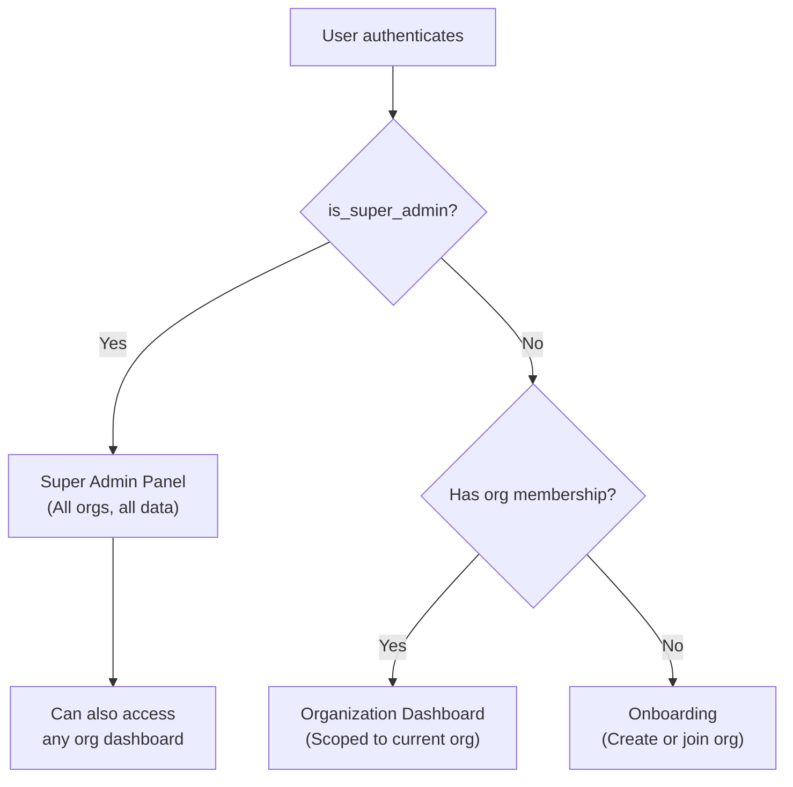

> [!IMPORTANT]
> Super admin is a **platform-level flag**, not an organization role. A super admin can access every organization's data, manage all users, and perform system-wide operations. This role is **never** assignable via the UI — only via an Artisan command.

#### UserRole Enum (Organization-Scoped)

```php
// app/Enums/UserRole.php

namespace App\Enums;

enum UserRole: string
{
    case OWNER  = 'owner';     // Full control, billing, can delete org
    case ADMIN  = 'admin';     // Manage team, settings, all CRUD
    case EDITOR = 'editor';    // Create/edit invoices, customers, products
    case VIEWER = 'viewer';    // Read-only access
    case MEMBER = 'member';    // Default role on invite

    public function label(): string
    {
        return match ($this) {
            self::OWNER  => 'Owner',
            self::ADMIN  => 'Administrator',
            self::EDITOR => 'Editor',
            self::VIEWER => 'Viewer',
            self::MEMBER => 'Member',
        };
    }

    /** Returns true if this role can manage team members */
    public function canManageTeam(): bool
    {
        return in_array($this, [self::OWNER, self::ADMIN]);
    }

    /** Returns true if this role can create/edit resources */
    public function canEdit(): bool
    {
        return in_array($this, [self::OWNER, self::ADMIN, self::EDITOR]);
    }
}
```

#### User Model — Super Admin Check

```php
// app/Models/User.php — additions

class User extends Authenticatable
{
    use HasFactory, Notifiable, HasApiTokens;

    protected $fillable = [
        'name', 'email', 'password', 'current_organization_id', 'is_super_admin',
    ];

    protected $hidden = ['password', 'remember_token'];

    protected function casts(): array
    {
        return [
            'email_verified_at' => 'datetime',
            'password'          => 'hashed',
            'is_super_admin'    => 'boolean',
        ];
    }

    public function isSuperAdmin(): bool
    {
        return $this->is_super_admin === true;
    }

    /**
     * Get the user's role in a specific organization.
     */
    public function roleIn(Organization $org): ?UserRole
    {
        $pivot = $this->organizations()
            ->where('organization_id', $org->id)
            ->first()?->pivot;

        return $pivot ? UserRole::from($pivot->role) : null;
    }

    public function organizations(): BelongsToMany
    {
        return $this->belongsToMany(Organization::class)->withPivot('role')->withTimestamps();
    }

    public function currentOrganization(): BelongsTo
    {
        return $this->belongsTo(Organization::class, 'current_organization_id');
    }

    public function currentOrganizationId(): ?int
    {
        return $this->current_organization_id;
    }
}
```

#### Migration

```php
// database/migrations/xxxx_add_is_super_admin_to_users_table.php

use Illuminate\Database\Migrations\Migration;
use Illuminate\Database\Schema\Blueprint;
use Illuminate\Support\Facades\Schema;

return new class extends Migration
{
    public function up(): void
    {
        Schema::table('users', function (Blueprint $table) {
            $table->boolean('is_super_admin')->default(false)->after('password');
        });
    }

    public function down(): void
    {
        Schema::table('users', function (Blueprint $table) {
            $table->dropColumn('is_super_admin');
        });
    }
};
```

#### EnsureSuperAdmin Middleware

```php
// app/Http/Middleware/EnsureSuperAdmin.php

namespace App\Http\Middleware;

use Closure;
use Illuminate\Http\Request;
use Symfony\Component\HttpFoundation\Response;

class EnsureSuperAdmin
{
    public function handle(Request $request, Closure $next): Response
    {
        if (!$request->user()?->isSuperAdmin()) {
            return response()->json([
                'message' => 'Forbidden. Super admin access required.',
            ], 403);
        }

        return $next($request);
    }
}
```

> [!NOTE]
> Super admin routes **do not** apply the `EnsureOrganizationScope` middleware. Super admins operate outside the organization context — they can query any organization's data by passing the `organization_id` as a parameter.

#### Artisan Command — Promote User

```php
// app/Console/Commands/MakeSuperAdmin.php

namespace App\Console\Commands;

use App\Models\User;
use Illuminate\Console\Command;

class MakeSuperAdmin extends Command
{
    protected $signature = 'veridex:make-super-admin {email}';
    protected $description = 'Promote a user to super admin';

    public function handle(): int
    {
        $email = $this->argument('email');
        $user = User::where('email', $email)->first();

        if (!$user) {
            $this->error("User with email '{$email}' not found.");
            return self::FAILURE;
        }

        if ($user->is_super_admin) {
            $this->warn("{$user->name} is already a super admin.");
            return self::SUCCESS;
        }

        $user->update(['is_super_admin' => true]);

        $this->info("✅ {$user->name} ({$email}) is now a super admin.");
        return self::SUCCESS;
    }
}
```

> [!CAUTION]
> There is **no API endpoint** to grant super admin. This is intentional — super admin promotion is a **server-side only** operation. If the database or API is compromised, an attacker cannot escalate to super admin without shell access.

#### Super Admin Controller

```php
// app/Http/Controllers/Api/SuperAdminController.php

namespace App\Http\Controllers\Api;

use App\Http\Controllers\Controller;
use App\Models\Organization;
use App\Models\User;
use App\Models\Invoice;
use App\Models\NrsSubmission;
use Illuminate\Http\JsonResponse;
use Illuminate\Http\Request;

class SuperAdminController extends Controller
{
    /**
     * Platform-wide dashboard stats.
     */
    public function dashboard(): JsonResponse
    {
        return response()->json([
            'data' => [
                'total_organizations' => Organization::count(),
                'total_users'         => User::count(),
                'total_invoices'      => Invoice::count(),
                'nrs_submissions'     => [
                    'total'   => NrsSubmission::count(),
                    'pending' => NrsSubmission::where('status', 'pending')->count(),
                    'failed'  => NrsSubmission::where('status', 'failed')->count(),
                ],
                'invoices_by_status'  => Invoice::selectRaw('status, count(*) as count')
                    ->groupBy('status')
                    ->pluck('count', 'status'),
            ],
        ]);
    }

    /**
     * List all organizations with stats.
     */
    public function organizations(Request $request): JsonResponse
    {
        $orgs = Organization::withCount(['invoices', 'users', 'customers'])
            ->when($request->search, fn($q, $s) => $q->where('name', 'like', "%{$s}%"))
            ->orderBy('created_at', 'desc')
            ->paginate($request->per_page ?? 20);

        return response()->json($orgs);
    }

    /**
     * List all users with their organization memberships.
     */
    public function users(Request $request): JsonResponse
    {
        $users = User::with('organizations:id,name')
            ->when($request->search, fn($q, $s) => $q->where('name', 'like', "%{$s}%")
                ->orWhere('email', 'like', "%{$s}%"))
            ->orderBy('created_at', 'desc')
            ->paginate($request->per_page ?? 20);

        return response()->json($users);
    }

    /**
     * View a specific organization's full details.
     */
    public function showOrganization(Organization $organization): JsonResponse
    {
        return response()->json([
            'data' => $organization->loadCount(['invoices', 'users', 'customers', 'products'])
                ->load('users:id,name,email'),
        ]);
    }

    /**
     * Platform-wide NRS submission logs.
     */
    public function nrsLogs(Request $request): JsonResponse
    {
        $logs = NrsSubmission::with(['invoice:id,invoice_number,irn', 'invoice.organization:id,name'])
            ->when($request->status, fn($q, $s) => $q->where('status', $s))
            ->when($request->action, fn($q, $a) => $q->where('action', $a))
            ->orderBy('created_at', 'desc')
            ->paginate($request->per_page ?? 50);

        return response()->json($logs);
    }
}
```

#### Super Admin Routes

```php
// routes/api.php — Super Admin route group

// Placed OUTSIDE the org.scope middleware group, INSIDE auth:sanctum
Route::middleware(['auth:sanctum', 'throttle:api', 'super_admin'])->prefix('admin')->group(function () {
    Route::get('/dashboard',                    [SuperAdminController::class, 'dashboard']);
    Route::get('/organizations',                [SuperAdminController::class, 'organizations']);
    Route::get('/organizations/{organization}', [SuperAdminController::class, 'showOrganization']);
    Route::get('/users',                        [SuperAdminController::class, 'users']);
    Route::get('/nrs-logs',                     [SuperAdminController::class, 'nrsLogs']);
});
```

#### Auth Response — Super Admin Flag

The `/me` endpoint and login/register responses include the `is_super_admin` flag:

```php
// In AuthController — updated response structure

return response()->json([
    'user' => [
        'id'                      => $user->id,
        'name'                    => $user->name,
        'email'                   => $user->email,
        'is_super_admin'          => $user->is_super_admin,
        'current_organization_id' => $user->current_organization_id,
        'current_organization'    => $user->currentOrganization,
    ],
    'token' => $token,
]);
```

#### Frontend — Super Admin Dashboard

The admin panel is a separate route group, guarded by the `is_super_admin` flag from the auth context.

```
┌─────────────────────────────────────────────────────────────────────────┐
│  ┌─ Super Admin Panel ──────────────────────────────────────────────┐  │
│  │  VERIDEX ADMIN                              [user@admin.com] ▼   │  │
│  ├──────────────────────────────────────────────────────────────────┤  │
│  │                                                                  │  │
│  │  ┌─── Platform Overview ───────────────────────────────────────┐ │  │
│  │  │                                                             │ │  │
│  │  │   ┌──────────┐  ┌──────────┐  ┌──────────┐  ┌──────────┐  │ │  │
│  │  │   │ Orgs     │  │ Users    │  │ Invoices │  │ NRS Calls│  │ │  │
│  │  │   │   42     │  │   156    │  │  1,247   │  │  3,891   │  │ │  │
│  │  │   └──────────┘  └──────────┘  └──────────┘  └──────────┘  │ │  │
│  │  │                                                             │ │  │
│  │  │   NRS Health: ● Online    Failed (24h): 12    Pending: 3   │ │  │
│  │  │                                                             │ │  │
│  │  └─────────────────────────────────────────────────────────────┘ │  │
│  │                                                                  │  │
│  │  ┌─── Organizations ──────────────────────────────────────────┐  │  │
│  │  │  [Search organizations...]                    [Export CSV]  │  │  │
│  │  │                                                            │  │  │
│  │  │  #   Name              TIN            Users  Invoices      │  │  │
│  │  │  ──  ────────────────  ─────────────  ─────  ────────      │  │  │
│  │  │  1   Dangote Group     TIN-0099990001   8      342         │  │  │
│  │  │  2   Zenith Foods      TIN-0012340001   3       87         │  │  │
│  │  │  3   Kuda Microfinance TIN-0056780001   5      218         │  │  │
│  │  │  4   Paystack Ltd      TIN-0098760001   12     501         │  │  │
│  │  │                                                            │  │  │
│  │  │  ← 1 2 3 ... 5 →                                          │  │  │
│  │  └────────────────────────────────────────────────────────────┘  │  │
│  │                                                                  │  │
│  │  ┌─── Recent NRS Failures ────────────────────────────────────┐  │  │
│  │  │  Invoice        Org              Action     Error    Time  │  │  │
│  │  │  ──────────     ─────────────    ────────   ──────   ────  │  │  │
│  │  │  INV-2026-042   Dangote Group    sign       422      2m    │  │  │
│  │  │  INV-2026-039   Zenith Foods     validate   500      15m   │  │  │
│  │  │  INV-2026-051   Kuda Micro       transmit   timeout  1h    │  │  │
│  │  │                                                [View All →]│  │  │
│  │  └────────────────────────────────────────────────────────────┘  │  │
│  │                                                                  │  │
│  └──────────────────────────────────────────────────────────────────┘  │
└─────────────────────────────────────────────────────────────────────────┘
```

#### Frontend — Route Guard & Types

```typescript
// src/types/admin.ts

export interface PlatformStats {
  total_organizations: number;
  total_users: number;
  total_invoices: number;
  nrs_submissions: {
    total: number;
    pending: number;
    failed: number;
  };
  invoices_by_status: Record<string, number>;
}

export interface AdminOrganization {
  id: number;
  name: string;
  tin: string;
  nrs_business_id: string;
  invoices_count: number;
  users_count: number;
  customers_count: number;
  created_at: string;
}

export interface AdminUser {
  id: number;
  name: string;
  email: string;
  is_super_admin: boolean;
  organizations: { id: number; name: string }[];
  created_at: string;
}
```

```typescript
// src/api/auth.ts — User type update

export interface User {
  id: number;
  name: string;
  email: string;
  is_super_admin: boolean;              // ← NEW
  current_organization_id: number;
  current_organization?: {
    id: number;
    name: string;
    nrs_business_id: string;
  };
}
```

```tsx
// src/App.tsx — Admin route guard

const router = createBrowserRouter([
  // ... existing routes ...

  // Super Admin Routes
  {
    path: '/admin',
    element: <SuperAdminGuard><AdminLayout /></SuperAdminGuard>,
    errorElement: <RouteErrorBoundary />,
    children: [
      { index: true, element: <AdminDashboardPage /> },
      { path: 'organizations', element: <AdminOrganizationsPage /> },
      { path: 'organizations/:id', element: <AdminOrganizationDetailPage /> },
      { path: 'users', element: <AdminUsersPage /> },
      { path: 'nrs-logs', element: <AdminNrsLogsPage /> },
    ],
  },
]);

// src/components/guards/SuperAdminGuard.tsx

function SuperAdminGuard({ children }: { children: ReactNode }) {
  const { user } = useAuth();

  if (!user?.is_super_admin) {
    return <Navigate to="/dashboard" replace />;
  }

  return <>{children}</>;
}
```

---

### 4.3 Data Transfer Objects (DTOs)

DTOs are **immutable value objects** that decouple HTTP requests from persistence. Each DTO is constructed from a validated FormRequest.

#### Invoice DTO

```php
// app/DTOs/Invoice/CreateInvoiceDTO.php

namespace App\DTOs\Invoice;

use App\Http\Requests\Invoice\StoreInvoiceRequest;

final readonly class CreateInvoiceDTO
{
    /**
     * @param InvoiceLineDTO[]        $lines
     * @param TaxTotalDTO[]           $taxTotals
     * @param AllowanceChargeDTO[]    $allowanceCharges
     * @param PaymentMeansDTO[]       $paymentMeans
     * @param DocReferenceDTO[]       $docReferences
     */
    public function __construct(
        public int     $organizationId,
        public int     $customerId,
        public string  $invoiceNumber,
        public string  $invoiceTypeCode,
        public string  $issueDate,
        public ?string $dueDate,
        public ?string $issueTime,
        public string  $documentCurrencyCode,
        public ?string $taxCurrencyCode,
        public ?string $paymentStatus,
        public ?string $note,
        public ?string $taxPointDate,
        public ?string $accountingCost,
        public ?string $buyerReference,
        public ?string $orderReference,
        public ?string $actualDeliveryDate,
        public ?string $deliveryPeriodStart,
        public ?string $deliveryPeriodEnd,
        public ?string $paymentTermsNote,
        public LegalMonetaryTotalDTO $legalMonetaryTotal,
        public array   $lines,
        public array   $taxTotals = [],
        public array   $allowanceCharges = [],
        public array   $paymentMeans = [],
        public array   $docReferences = [],
        public int     $createdBy = 0,
    ) {}

    public static function fromRequest(StoreInvoiceRequest $request): self
    {
        $validated = $request->validated();

        return new self(
            organizationId:       $request->user()->currentOrganizationId(),
            customerId:           $validated['customer_id'],
            invoiceNumber:        $validated['invoice_number'],
            invoiceTypeCode:      $validated['invoice_type_code'],
            issueDate:            $validated['issue_date'],
            dueDate:              $validated['due_date'] ?? null,
            issueTime:            $validated['issue_time'] ?? null,
            documentCurrencyCode: $validated['document_currency_code'],
            taxCurrencyCode:      $validated['tax_currency_code'] ?? null,
            paymentStatus:        $validated['payment_status'] ?? 'PENDING',
            note:                 $validated['note'] ?? null,
            taxPointDate:         $validated['tax_point_date'] ?? null,
            accountingCost:       $validated['accounting_cost'] ?? null,
            buyerReference:       $validated['buyer_reference'] ?? null,
            orderReference:       $validated['order_reference'] ?? null,
            actualDeliveryDate:   $validated['actual_delivery_date'] ?? null,
            deliveryPeriodStart:  $validated['delivery_period_start'] ?? null,
            deliveryPeriodEnd:    $validated['delivery_period_end'] ?? null,
            paymentTermsNote:     $validated['payment_terms_note'] ?? null,
            legalMonetaryTotal:   LegalMonetaryTotalDTO::fromArray($validated['legal_monetary_total']),
            lines:                array_map(fn($l) => InvoiceLineDTO::fromArray($l), $validated['invoice_lines']),
            taxTotals:            array_map(fn($t) => TaxTotalDTO::fromArray($t), $validated['tax_totals'] ?? []),
            allowanceCharges:     array_map(fn($a) => AllowanceChargeDTO::fromArray($a), $validated['allowance_charges'] ?? []),
            paymentMeans:         array_map(fn($p) => PaymentMeansDTO::fromArray($p), $validated['payment_means'] ?? []),
            docReferences:        array_map(fn($d) => DocReferenceDTO::fromArray($d), $validated['doc_references'] ?? []),
            createdBy:            $request->user()->id,
        );
    }

    public function toInvoiceArray(): array
    {
        return [
            'organization_id'        => $this->organizationId,
            'customer_id'            => $this->customerId,
            'invoice_number'         => $this->invoiceNumber,
            'invoice_type_code'      => $this->invoiceTypeCode,
            'status'                 => 'draft',
            'payment_status'         => $this->paymentStatus,
            'issue_date'             => $this->issueDate,
            'due_date'               => $this->dueDate,
            'issue_time'             => $this->issueTime,
            'document_currency_code' => $this->documentCurrencyCode,
            'tax_currency_code'      => $this->taxCurrencyCode,
            'note'                   => $this->note,
            'tax_point_date'         => $this->taxPointDate,
            'accounting_cost'        => $this->accountingCost,
            'buyer_reference'        => $this->buyerReference,
            'order_reference'        => $this->orderReference,
            'actual_delivery_date'   => $this->actualDeliveryDate,
            'delivery_period_start'  => $this->deliveryPeriodStart,
            'delivery_period_end'    => $this->deliveryPeriodEnd,
            'payment_terms_note'     => $this->paymentTermsNote,
            'line_extension_amount'  => $this->legalMonetaryTotal->lineExtensionAmount,
            'tax_exclusive_amount'   => $this->legalMonetaryTotal->taxExclusiveAmount,
            'tax_inclusive_amount'   => $this->legalMonetaryTotal->taxInclusiveAmount,
            'payable_amount'         => $this->legalMonetaryTotal->payableAmount,
            'created_by'             => $this->createdBy,
        ];
    }
}
```

#### NRS Payload DTO

```php
// app/DTOs/Nrs/NrsInvoicePayloadDTO.php

namespace App\DTOs\Nrs;

final readonly class NrsInvoicePayloadDTO
{
    public function __construct(
        public string               $businessId,
        public string               $irn,
        public string               $issueDate,
        public string               $invoiceTypeCode,
        public string               $documentCurrencyCode,
        public NrsPartyDTO           $accountingSupplierParty,
        public NrsPartyDTO           $accountingCustomerParty,
        public NrsMonetaryTotalDTO   $legalMonetaryTotal,
        /** @var NrsInvoiceLineDTO[] */
        public array                $invoiceLines,
        public ?string              $dueDate = null,
        public ?string              $issueTime = null,
        public ?string              $paymentStatus = null,
        public ?string              $note = null,
        public ?string              $taxPointDate = null,
        public ?string              $taxCurrencyCode = null,
        public ?string              $accountingCost = null,
        public ?string              $buyerReference = null,
        public ?string              $orderReference = null,
        public ?string              $actualDeliveryDate = null,
        public ?array               $invoiceDeliveryPeriod = null,
        public ?array               $billingReference = null,
        public ?array               $paymentMeans = null,
        public ?string              $paymentTermsNote = null,
        public ?array               $allowanceCharge = null,
        public ?array               $taxTotal = null,
    ) {}

    /** Converts to the exact JSON structure NRS API expects */
    public function toNrsArray(): array
    {
        $payload = [
            'business_id'             => $this->businessId,
            'irn'                     => $this->irn,
            'issue_date'              => $this->issueDate,
            'invoice_type_code'       => $this->invoiceTypeCode,
            'document_currency_code'  => $this->documentCurrencyCode,
            'accounting_supplier_party' => $this->accountingSupplierParty->toNrsArray(),
            'accounting_customer_party' => $this->accountingCustomerParty->toNrsArray(),
            'legal_monetary_total'    => $this->legalMonetaryTotal->toNrsArray(),
            'invoice_line'            => array_map(fn($l) => $l->toNrsArray(), $this->invoiceLines),
        ];

        // Append optional fields only if present
        foreach (['due_date', 'issue_time', 'payment_status', /* ... */] as $field) {
            if ($this->{$this->camelCase($field)} !== null) {
                $payload[$field] = $this->{$this->camelCase($field)};
            }
        }

        return $payload;
    }
}
```

#### Sub-DTOs

```php
// app/DTOs/Invoice/InvoiceLineDTO.php
final readonly class InvoiceLineDTO
{
    public function __construct(
        public string  $itemName,
        public string  $itemDescription,
        public float   $invoicedQuantity,
        public float   $priceAmount,
        public float   $lineExtensionAmount,
        public string  $hsnCode,
        public string  $productCategory,
        public float   $baseQuantity,
        public string  $priceUnit,
        public ?int    $productId = null,
        public ?string $sellersItemIdentification = null,
        public ?float  $discountRate = null,
        public ?float  $discountAmount = null,
        public ?float  $feeRate = null,
        public ?float  $feeAmount = null,
    ) {}

    public static function fromArray(array $data): self { /* ... */ }
    public function toArray(): array { /* ... */ }
}

// app/DTOs/Invoice/TaxTotalDTO.php
final readonly class TaxTotalDTO
{
    public function __construct(
        public float  $taxAmount,
        public float  $taxableAmount,
        public float  $subtotalTaxAmount,
        public string $taxCategoryId,
        public float  $taxPercent,
    ) {}
}

// app/DTOs/Invoice/AllowanceChargeDTO.php
final readonly class AllowanceChargeDTO
{
    public function __construct(
        public bool  $chargeIndicator,
        public float $amount,
    ) {}
}

// app/DTOs/Invoice/PaymentMeansDTO.php
final readonly class PaymentMeansDTO
{
    public function __construct(
        public string  $paymentMeansCode,
        public ?string $paymentDueDate = null,
    ) {}
}

// app/DTOs/Invoice/LegalMonetaryTotalDTO.php
final readonly class LegalMonetaryTotalDTO
{
    public function __construct(
        public float $lineExtensionAmount,
        public float $taxExclusiveAmount,
        public float $taxInclusiveAmount,
        public float $payableAmount,
    ) {}
}
```

---

### 4.4 Form Requests (Validation Layer)

```php
// app/Http/Requests/Invoice/StoreInvoiceRequest.php

namespace App\Http\Requests\Invoice;

use Illuminate\Foundation\Http\FormRequest;

class StoreInvoiceRequest extends FormRequest
{
    public function authorize(): bool
    {
        return $this->user()->can('create', Invoice::class);
    }

    public function rules(): array
    {
        return [
            // Core
            'customer_id'              => ['required', 'exists:customers,id'],
            'invoice_number'           => ['required', 'string', 'alpha_num', 'max:50', 'unique:invoices,invoice_number'],
            'invoice_type_code'        => ['required', 'string'],
            'issue_date'               => ['required', 'date', 'date_format:Y-m-d'],
            'due_date'                 => ['nullable', 'date', 'date_format:Y-m-d', 'after_or_equal:issue_date'],
            'issue_time'               => ['nullable', 'date_format:H:i:s'],
            'document_currency_code'   => ['required', 'string', 'size:3'],
            'tax_currency_code'        => ['nullable', 'string', 'size:3'],
            'payment_status'           => ['nullable', 'in:PENDING,PAID,REJECTED'],
            'note'                     => ['nullable', 'string', 'max:2000'],
            'tax_point_date'           => ['nullable', 'date', 'date_format:Y-m-d'],
            'accounting_cost'          => ['nullable', 'string', 'max:255'],
            'buyer_reference'          => ['nullable', 'string', 'max:255'],
            'order_reference'          => ['nullable', 'string', 'max:255'],
            'actual_delivery_date'     => ['nullable', 'date', 'date_format:Y-m-d'],
            'delivery_period_start'    => ['nullable', 'date', 'date_format:Y-m-d'],
            'delivery_period_end'      => ['nullable', 'date', 'date_format:Y-m-d', 'after_or_equal:delivery_period_start'],
            'payment_terms_note'       => ['nullable', 'string', 'max:1000'],

            // Legal Monetary Total
            'legal_monetary_total'                        => ['required', 'array'],
            'legal_monetary_total.line_extension_amount'   => ['required', 'numeric', 'min:0'],
            'legal_monetary_total.tax_exclusive_amount'    => ['required', 'numeric', 'min:0'],
            'legal_monetary_total.tax_inclusive_amount'    => ['required', 'numeric', 'min:0'],
            'legal_monetary_total.payable_amount'          => ['required', 'numeric', 'min:0'],

            // Invoice Lines (at least 1)
            'invoice_lines'                                => ['required', 'array', 'min:1'],
            'invoice_lines.*.item_name'                    => ['required', 'string', 'max:255'],
            'invoice_lines.*.item_description'             => ['required', 'string', 'max:1000'],
            'invoice_lines.*.hsn_code'                     => ['required', 'string'],
            'invoice_lines.*.product_category'             => ['required', 'string'],
            'invoice_lines.*.invoiced_quantity'             => ['required', 'numeric', 'min:0.0001'],
            'invoice_lines.*.price_amount'                 => ['required', 'numeric', 'min:0'],
            'invoice_lines.*.base_quantity'                => ['required', 'numeric', 'min:0.0001'],
            'invoice_lines.*.price_unit'                   => ['required', 'string'],
            'invoice_lines.*.line_extension_amount'        => ['required', 'numeric', 'min:0'],
            'invoice_lines.*.product_id'                   => ['nullable', 'exists:products,id'],
            'invoice_lines.*.sellers_item_identification'  => ['nullable', 'string'],
            'invoice_lines.*.discount_rate'                => ['nullable', 'numeric', 'min:0'],
            'invoice_lines.*.discount_amount'              => ['nullable', 'numeric', 'min:0'],
            'invoice_lines.*.fee_rate'                     => ['nullable', 'numeric', 'min:0'],
            'invoice_lines.*.fee_amount'                   => ['nullable', 'numeric', 'min:0'],

            // Tax Totals
            'tax_totals'                                   => ['nullable', 'array'],
            'tax_totals.*.tax_amount'                      => ['required', 'numeric'],
            'tax_totals.*.taxable_amount'                  => ['required', 'numeric'],
            'tax_totals.*.subtotal_tax_amount'             => ['required', 'numeric'],
            'tax_totals.*.tax_category_id'                 => ['required', 'string'],
            'tax_totals.*.tax_percent'                     => ['required', 'numeric'],

            // Allowance Charges
            'allowance_charges'                            => ['nullable', 'array'],
            'allowance_charges.*.charge_indicator'         => ['required', 'boolean'],
            'allowance_charges.*.amount'                   => ['required', 'numeric', 'min:0'],

            // Payment Means
            'payment_means'                                => ['nullable', 'array'],
            'payment_means.*.payment_means_code'           => ['required', 'string'],
            'payment_means.*.payment_due_date'             => ['nullable', 'date', 'date_format:Y-m-d'],

            // Document References
            'doc_references'                               => ['nullable', 'array'],
            'doc_references.*.type'                        => ['required', 'in:billing,dispatch,receipt,originator,contract,additional'],
            'doc_references.*.irn'                         => ['required', 'string'],
            'doc_references.*.issue_date'                  => ['required', 'date', 'date_format:Y-m-d'],
        ];
    }
}
```

```php
// app/Http/Requests/Invoice/UpdatePaymentStatusRequest.php
class UpdatePaymentStatusRequest extends FormRequest
{
    public function rules(): array
    {
        return [
            'payment_status' => ['required', 'in:PENDING,PAID,REJECTED'],
            'reference'      => ['nullable', 'string', 'max:500'],
        ];
    }
}

// app/Http/Requests/Customer/StoreCustomerRequest.php
class StoreCustomerRequest extends FormRequest
{
    public function rules(): array
    {
        return [
            'party_name'            => ['required', 'string', 'max:255'],
            'tin'                   => ['required', 'string', 'regex:/^TIN-\d+$/'],
            'email'                 => ['required', 'email', 'max:255'],
            'telephone'             => ['nullable', 'string', 'regex:/^\+\d+$/'],
            'business_description'  => ['nullable', 'string', 'max:1000'],
            'type'                  => ['required', 'in:business,individual,government'],
            'street_name'           => ['required', 'string', 'max:255'],
            'city_name'             => ['required', 'string', 'max:255'],
            'postal_zone'           => ['required', 'string', 'max:20'],
            'country'               => ['required', 'string', 'size:2'],
        ];
    }
}
```

---

### 4.5 Controller Flow (Request → DTO → Service → Repository)

```php
// app/Http/Controllers/Api/InvoiceController.php

class InvoiceController extends Controller
{
    public function __construct(
        private InvoiceService      $invoiceService,
        private InvoiceStateService $stateService,
        private ActivityLogService  $activityLog,
    ) {}

    public function store(StoreInvoiceRequest $request): JsonResponse
    {
        $dto = CreateInvoiceDTO::fromRequest($request);
        $invoice = $this->invoiceService->create($dto);

        $this->activityLog->log($request->user(), 'created', $invoice, 'Invoice created');

        return InvoiceDetailResource::make($invoice)
            ->response()
            ->setStatusCode(201);
    }

    public function validateOnNrs(
        ValidateInvoiceOnNrsRequest $request,
        Invoice $invoice
    ): JsonResponse {
        $result = $this->invoiceService->validateOnNrs($invoice);

        $this->activityLog->log(
            $request->user(), 'nrs_validate', $invoice,
            $result->success ? 'NRS validation passed' : 'NRS validation failed'
        );

        return response()->json($result);
    }

    public function updatePayment(
        UpdatePaymentStatusRequest $request,
        Invoice $invoice
    ): JsonResponse {
        $dto = UpdatePaymentDTO::fromRequest($request);
        $invoice = $this->invoiceService->updatePayment($invoice, $dto);

        $this->activityLog->log($request->user(), 'payment_updated', $invoice,
            "Payment status changed to {$dto->paymentStatus}");

        return InvoiceDetailResource::make($invoice);
    }
}
```

---

## 5. Invoice State Timeline & Activity Logs

### 5.1 Invoice State Transitions — `invoice_state_transitions`

Every status change for every invoice is recorded as an immutable timeline entry.

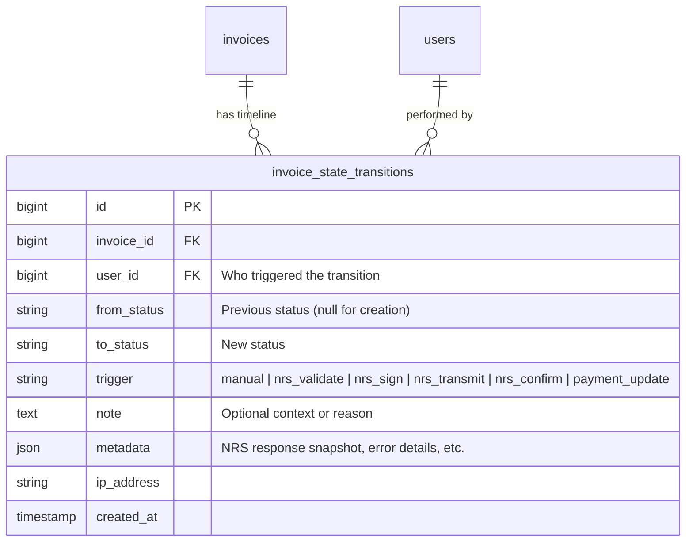

#### Service

```php
// app/Services/InvoiceStateService.php

class InvoiceStateService
{
    public function __construct(
        private InvoiceStateRepositoryInterface $stateRepo,
    ) {}

    public function transition(
        Invoice $invoice,
        string  $toStatus,
        User    $user,
        string  $trigger,
        ?string $note = null,
        ?array  $metadata = null,
    ): InvoiceStateTransition {
        $fromStatus = $invoice->status;

        // Validate transition is allowed
        $this->validateTransition($fromStatus, $toStatus);

        // Record the transition
        $transition = InvoiceStateTransition::create([
            'invoice_id'  => $invoice->id,
            'user_id'     => $user->id,
            'from_status' => $fromStatus,
            'to_status'   => $toStatus,
            'trigger'     => $trigger,
            'note'        => $note,
            'metadata'    => $metadata,
            'ip_address'  => request()->ip(),
        ]);

        // Update invoice status
        $invoice->update(['status' => $toStatus]);

        // Fire event
        event(new InvoiceStatusChanged($invoice, $transition));

        return $transition;
    }

    private function validateTransition(string $from, string $to): void
    {
        $allowed = [
            'draft'              => ['pending_validation', 'cancelled'],
            'pending_validation' => ['validated', 'validation_failed'],
            'validated'          => ['pending_signing'],
            'validation_failed'  => ['draft'],                           // Fix & retry
            'pending_signing'    => ['signed', 'sign_failed'],
            'signed'             => ['pending_transmit'],
            'sign_failed'        => ['validated'],                       // Retry
            'pending_transmit'   => ['transmitted', 'transmit_failed'],
            'transmitted'        => ['confirmed'],
            'transmit_failed'    => ['signed'],                          // Retry
        ];

        if (!in_array($to, $allowed[$from] ?? [])) {
            throw new InvoiceStateException(
                "Cannot transition from '{$from}' to '{$to}'"
            );
        }
    }
}
```

---

### 5.2 NRS Submission Logs — `nrs_submissions`

Every API call to the NRS platform is logged with full request/response payloads.

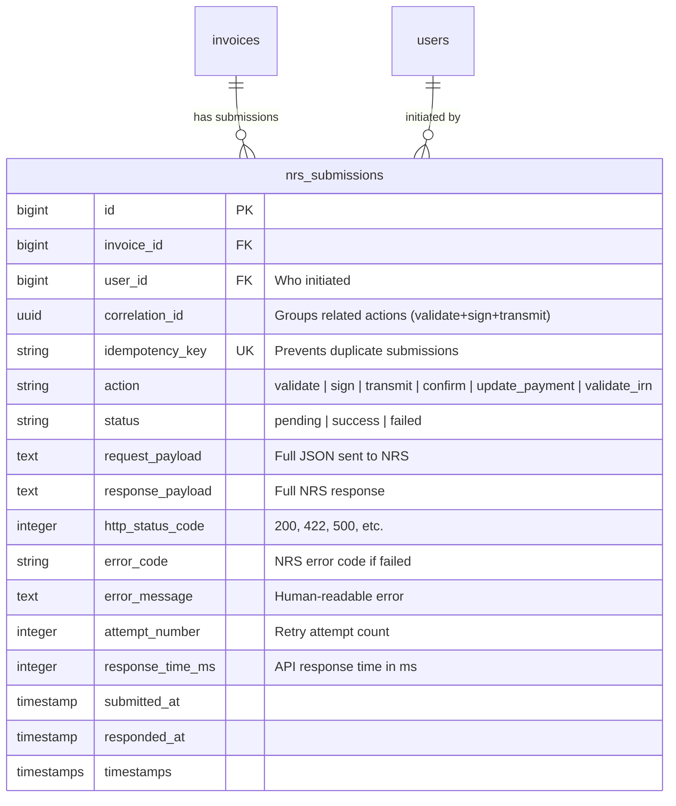

#### Correlation ID

When a user triggers the full invoice lifecycle (Validate → Sign → Transmit), a single `correlation_id` (UUID v7) is generated and propagated through all submissions for that flow:

```php
// In NrsInvoiceService — initiate a correlated flow
$correlationId = Str::uuid7();

// Each step uses the same correlation_id
NrsSubmission::create([
    'invoice_id'     => $invoice->id,
    'correlation_id' => $correlationId,
    'action'         => 'validate',
    // ...
]);

// Later, when signing the same invoice from the same flow:
NrsSubmission::create([
    'invoice_id'     => $invoice->id,
    'correlation_id' => $correlationId,  // Same ID
    'action'         => 'sign',
    // ...
]);
```

**Query all actions for a single flow:**
```php
NrsSubmission::where('correlation_id', $correlationId)
    ->orderBy('submitted_at')
    ->get();
```

---

### 5.3 User Activity Logs — `activity_logs`

Comprehensive audit trail tracking all user actions across the platform.

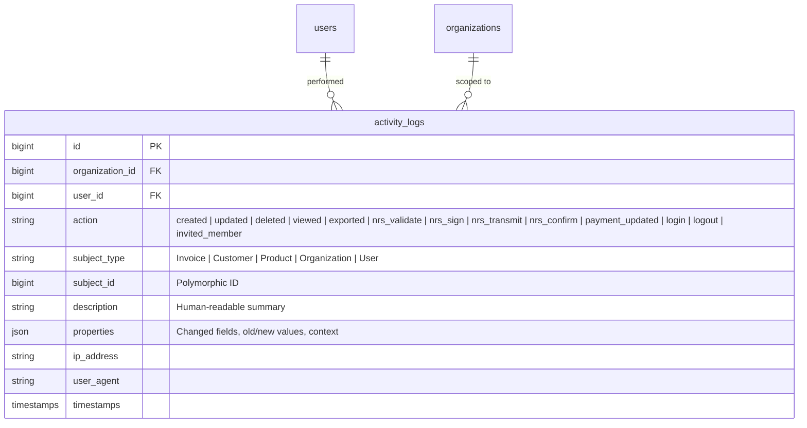

#### Activity Log Service

```php
// app/Services/ActivityLogService.php

class ActivityLogService
{
    public function log(
        User    $user,
        string  $action,
        ?Model  $subject = null,
        ?string $description = null,
        ?array  $properties = null,
    ): ActivityLog {
        return ActivityLog::create([
            'organization_id' => $user->currentOrganizationId(),
            'user_id'         => $user->id,
            'action'          => $action,
            'subject_type'    => $subject ? get_class($subject) : null,
            'subject_id'      => $subject?->id,
            'description'     => $description,
            'properties'      => $properties,
            'ip_address'      => request()->ip(),
            'user_agent'      => request()->userAgent(),
        ]);
    }

    /** Log model changes (old vs new values) */
    public function logChange(User $user, string $action, Model $subject, array $original): ActivityLog
    {
        $changes = $subject->getChanges();
        $oldValues = array_intersect_key($original, $changes);

        return $this->log($user, $action, $subject, null, [
            'old' => $oldValues,
            'new' => $changes,
        ]);
    }
}
```

#### API Route for Activity Logs

```php
// In routes/api.php
Route::get('/invoices/{invoice}/timeline',     [InvoiceController::class, 'timeline']);
Route::get('/invoices/{invoice}/submissions',  [InvoiceController::class, 'submissions']);
Route::get('/activity-logs',                   [ActivityLogController::class, 'index']);
```

---

## 6. Database Schema (Complete)

### 6.1 Entity Relationship Diagram

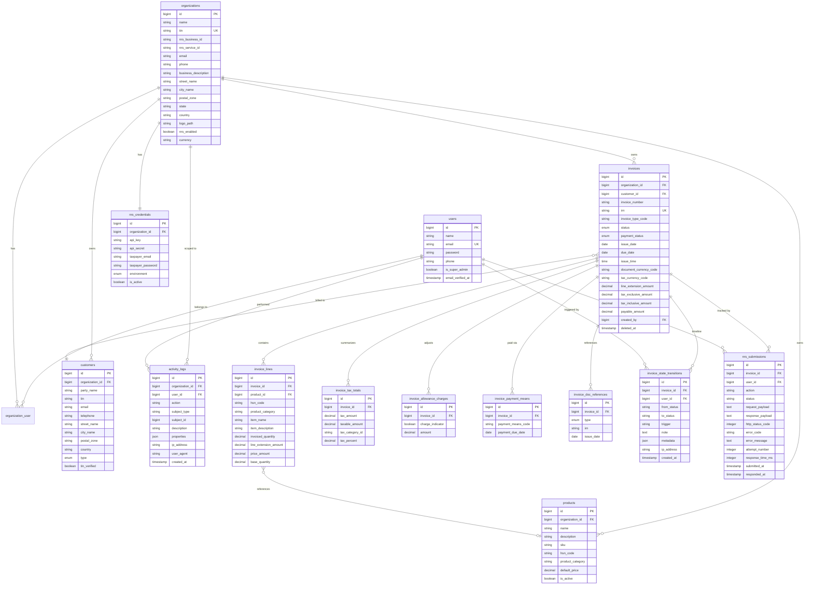

---

## 7. Frontend Architecture (React + Vite + TypeScript)

### 7.1 Error Boundary Architecture

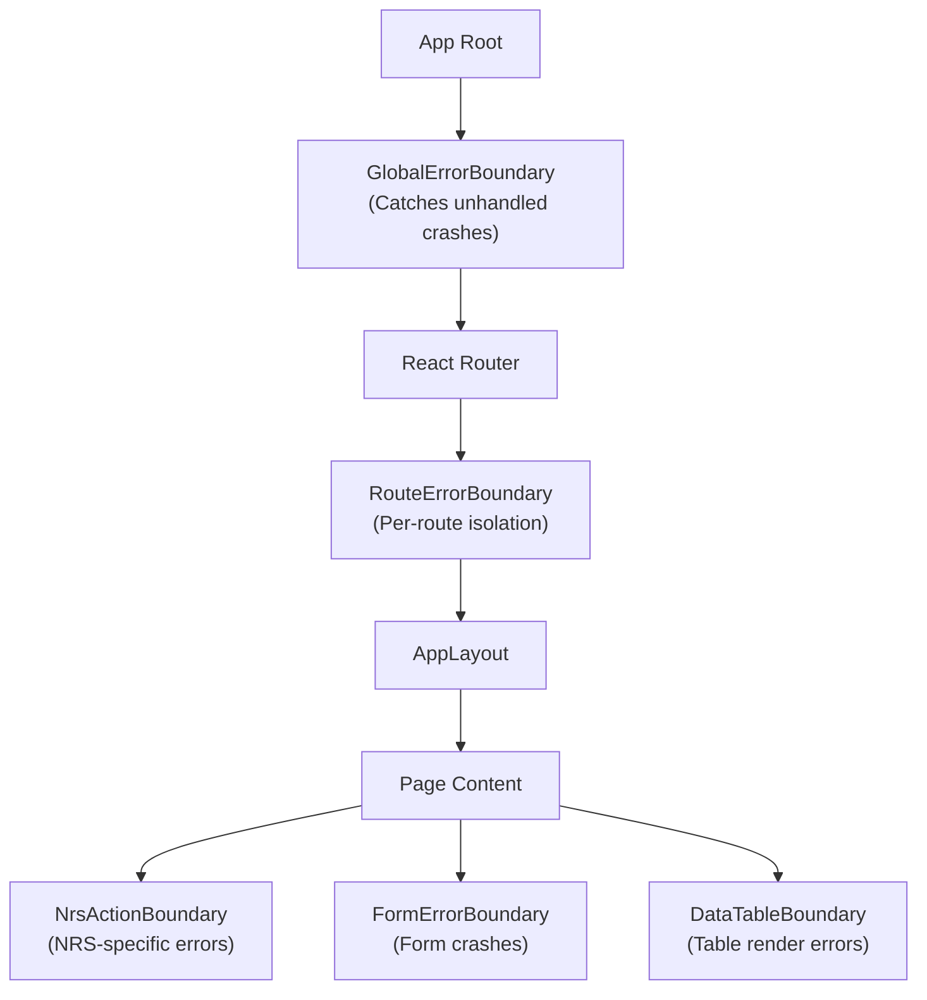

#### Error Boundary Components

```
src/
├── components/
│   ├── errors/
│   │   ├── GlobalErrorBoundary.tsx        # Top-level: full-page error with reload
│   │   ├── RouteErrorBoundary.tsx         # Route-level: "This page crashed" with nav
│   │   ├── NrsActionBoundary.tsx          # NRS actions: "NRS service error" with retry
│   │   ├── FormErrorBoundary.tsx          # Form crashes: preserve data + show fallback
│   │   ├── ComponentErrorBoundary.tsx     # Generic wrapper for any component
│   │   ├── ErrorFallback.tsx             # Reusable fallback UI
│   │   └── NrsErrorFallback.tsx          # NRS-specific fallback with status
```

#### Implementation

```tsx
// src/components/errors/GlobalErrorBoundary.tsx
import { Component, ErrorInfo, ReactNode } from 'react';

interface Props { children: ReactNode; }
interface State { hasError: boolean; error: Error | null; }

export class GlobalErrorBoundary extends Component<Props, State> {
  state: State = { hasError: false, error: null };

  static getDerivedStateFromError(error: Error): State {
    return { hasError: true, error };
  }

  componentDidCatch(error: Error, errorInfo: ErrorInfo) {
    // Log to error reporting service (Sentry, etc.)
    console.error('Unhandled error:', error, errorInfo);
  }

  render() {
    if (this.state.hasError) {
      return (
        <div className="min-h-screen flex items-center justify-center bg-background">
          <div className="text-center space-y-4 p-8">
            <h1 className="text-2xl font-bold">Something went wrong</h1>
            <p className="text-muted-foreground">{this.state.error?.message}</p>
            <button onClick={() => window.location.reload()}>Reload Application</button>
          </div>
        </div>
      );
    }
    return this.props.children;
  }
}

// src/components/errors/NrsActionBoundary.tsx
export class NrsActionBoundary extends Component<Props, State> {
  state: State = { hasError: false, error: null };

  static getDerivedStateFromError(error: Error): State {
    return { hasError: true, error };
  }

  handleRetry = () => {
    this.setState({ hasError: false, error: null });
  };

  render() {
    if (this.state.hasError) {
      return (
        <NrsErrorFallback
          error={this.state.error}
          onRetry={this.handleRetry}
          title="NRS Action Failed"
          description="The NRS service encountered an error. You can retry or check the submission logs."
        />
      );
    }
    return this.props.children;
  }
}

// src/components/errors/ComponentErrorBoundary.tsx
// Generic wrapper — use for any risky component
export function withErrorBoundary<P extends object>(
  Component: React.ComponentType<P>,
  fallback?: ReactNode
) {
  return function WrappedComponent(props: P) {
    return (
      <ComponentErrorBoundary fallback={fallback}>
        <Component {...props} />
      </ComponentErrorBoundary>
    );
  };
}
```

#### Usage in App

```tsx
// src/App.tsx
import { GlobalErrorBoundary } from '@/components/errors/GlobalErrorBoundary';
import { RouteErrorBoundary } from '@/components/errors/RouteErrorBoundary';

function App() {
  return (
    <GlobalErrorBoundary>
      <QueryClientProvider client={queryClient}>
        <AuthProvider>
          <RouterProvider router={router} />
        </AuthProvider>
      </QueryClientProvider>
    </GlobalErrorBoundary>
  );
}

// Route config with error boundaries
const router = createBrowserRouter([
  {
    path: '/',
    element: <AppLayout />,
    errorElement: <RouteErrorBoundary />,
    children: [
      { path: 'dashboard', element: <DashboardPage /> },
      { path: 'invoices',  element: <InvoiceListPage /> },
      { path: 'invoices/:id', element: <InvoiceDetailPage /> },
      // ...
    ],
  },
  {
    path: '/login',
    element: <AuthLayout />,
    errorElement: <RouteErrorBoundary />,
    children: [
      { index: true, element: <LoginPage /> },
    ],
  },
]);

// In InvoiceDetailPage — NRS actions wrapped
function InvoiceDetailPage() {
  return (
    <div>
      {/* Invoice details */}
      <InvoiceHeader />

      {/* NRS actions — isolated error boundary */}
      <NrsActionBoundary>
        <InvoiceNrsActions invoice={invoice} />
        <InvoiceNrsTimeline invoiceId={invoice.id} />
      </NrsActionBoundary>

      {/* Submission history */}
      <ComponentErrorBoundary fallback={<p>Failed to load submissions</p>}>
        <InvoiceSubmissionLog invoiceId={invoice.id} />
      </ComponentErrorBoundary>
    </div>
  );
}
```

---

### 7.2 Project Structure (Updated)

```
veridex-frontend/src/
├── main.tsx
├── App.tsx
├── index.css
│
├── api/
│   ├── client.ts
│   ├── auth.ts
│   ├── invoices.ts
│   ├── customers.ts
│   ├── products.ts
│   ├── dashboard.ts
│   ├── nrs.ts
│   ├── reports.ts
│   ├── activity-logs.ts                     # ← NEW
│   └── organization.ts
│
├── hooks/
│   ├── useAuth.ts
│   ├── useInvoices.ts
│   ├── useInvoiceTimeline.ts                # ← NEW
│   ├── useInvoiceSubmissions.ts             # ← NEW
│   ├── useActivityLogs.ts                   # ← NEW
│   ├── useCustomers.ts
│   ├── useProducts.ts
│   ├── useDashboard.ts
│   ├── useNrsResources.ts
│   └── useDebounce.ts
│
├── contexts/
│   ├── AuthContext.tsx
│   ├── OrganizationContext.tsx
│   └── ThemeContext.tsx
│
├── pages/
│   ├── auth/
│   │   ├── LoginPage.tsx
│   │   ├── RegisterPage.tsx
│   │   └── ForgotPasswordPage.tsx
│   ├── dashboard/
│   │   └── DashboardPage.tsx
│   ├── invoices/
│   │   ├── InvoiceListPage.tsx
│   │   ├── InvoiceCreatePage.tsx             # Multi-step: Form → Preview → Create
│   │   ├── InvoiceEditPage.tsx               # Multi-step: Form → Preview → Save
│   │   ├── InvoicePreviewPage.tsx            # ← NEW: Full-page preview before create/submit
│   │   └── InvoiceDetailPage.tsx
│   ├── customers/
│   │   ├── CustomerListPage.tsx
│   │   └── CustomerDetailPage.tsx
│   ├── products/
│   │   └── ProductListPage.tsx
│   ├── reports/
│   │   └── ReportsPage.tsx
│   ├── activity/
│   │   └── ActivityLogPage.tsx
│   ├── settings/
│   │   ├── OrganizationSettingsPage.tsx
│   │   ├── NrsConfigPage.tsx
│   │   ├── TeamMembersPage.tsx
│   │   └── ProfilePage.tsx
│   └── admin/                               # ← NEW: Super Admin
│       ├── AdminDashboardPage.tsx
│       ├── AdminOrganizationsPage.tsx
│       ├── AdminOrganizationDetailPage.tsx
│       ├── AdminUsersPage.tsx
│       └── AdminNrsLogsPage.tsx
│
├── components/
│   ├── ui/                                  # shadcn/ui primitives
│   │
│   ├── errors/                              # ← NEW: Error Boundaries
│   │   ├── GlobalErrorBoundary.tsx
│   │   ├── RouteErrorBoundary.tsx
│   │   ├── NrsActionBoundary.tsx
│   │   ├── FormErrorBoundary.tsx
│   │   ├── ComponentErrorBoundary.tsx
│   │   ├── ErrorFallback.tsx
│   │   └── NrsErrorFallback.tsx
│   │
│   ├── layout/
│   │   ├── AppLayout.tsx
│   │   ├── Sidebar.tsx
│   │   ├── Header.tsx
│   │   └── AuthLayout.tsx
│   │
│   ├── invoices/
│   │   ├── InvoiceForm.tsx                  # Form entry (step 1)
│   │   ├── InvoiceLineItems.tsx
│   │   ├── InvoiceTaxTotals.tsx
│   │   ├── InvoiceMonetaryTotals.tsx
│   │   ├── InvoiceAllowanceCharges.tsx
│   │   ├── InvoicePaymentMeans.tsx
│   │   ├── InvoiceDocReferences.tsx
│   │   ├── InvoicePartyInfo.tsx
│   │   ├── InvoiceStatusBadge.tsx
│   │   ├── InvoiceNrsActions.tsx
│   │   ├── InvoiceStateTimeline.tsx
│   │   ├── InvoiceSubmissionLog.tsx
│   │   ├── InvoiceActivityFeed.tsx
│   │   │
│   │   ├── preview/                         # ← NEW: Preview UI components
│   │   │   ├── InvoicePreviewDocument.tsx   # Formatted invoice document layout
│   │   │   ├── PreviewHeader.tsx            # Supplier/Customer party info side-by-side
│   │   │   ├── PreviewLineItemsTable.tsx    # Formatted line items table
│   │   │   ├── PreviewTaxSummary.tsx        # Tax breakdown display
│   │   │   ├── PreviewTotals.tsx            # Monetary totals (subtotal → payable)
│   │   │   ├── PreviewPaymentInfo.tsx       # Payment means + terms
│   │   │   ├── PreviewValidationPanel.tsx   # Validation warnings/errors sidebar
│   │   │   ├── PreviewNrsReadiness.tsx      # NRS submission readiness checklist
│   │   │   └── PreviewActions.tsx           # Back to Edit / Save Draft / Create & Submit
│   │   │
│   │   └── InvoiceFormStepper.tsx           # ← NEW: Step indicator (Form → Preview → Done)
│   │
│   ├── dashboard/
│   │   ├── StatsCards.tsx
│   │   ├── RevenueChart.tsx
│   │   ├── RecentInvoicesTable.tsx
│   │   └── NrsHealthIndicator.tsx
│   │
│   ├── activity/                            # ← NEW
│   │   └── ActivityFeed.tsx                 # Reusable activity log component
│   │
│   ├── customers/
│   │   └── CustomerForm.tsx
│   │
│   ├── guards/                              # ← NEW: Route guards
│   │   └── SuperAdminGuard.tsx
│   │
│   └── shared/
│       ├── DataTable.tsx
│       ├── EmptyState.tsx
│       ├── LoadingSpinner.tsx
│       ├── ConfirmDialog.tsx
│       ├── Timeline.tsx                     # ← NEW: Reusable timeline component
│       └── CurrencyDisplay.tsx
│
├── lib/
│   ├── utils.ts
│   ├── formatters.ts
│   ├── validators.ts
│   └── constants.ts
│
└── types/
    ├── auth.ts
    ├── invoice.ts
    ├── customer.ts
    ├── product.ts
    ├── nrs.ts
    ├── timeline.ts                          # ← NEW
    ├── activity.ts                          # ← NEW
    ├── organization.ts
    ├── admin.ts                              # ← NEW
    └── api.ts
```

### 7.3 Invoice Creation Flow — Multi-Step with Preview

Invoice creation/editing follows a **2-step** flow: **Form Entry → Preview & Validate → Commit**.

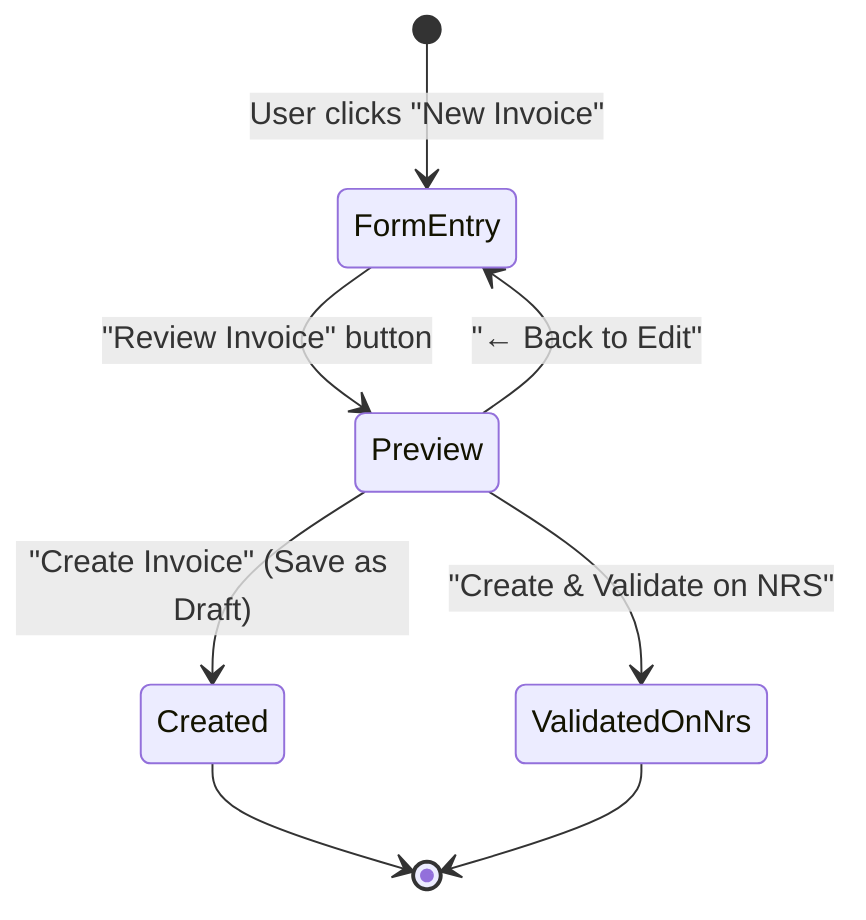

#### Step 1: Form Entry (`InvoiceCreatePage`)

The invoice form with all fields. On submit, client-side validation (Zod) runs first. If valid, navigates to Preview.

```tsx
// In InvoiceCreatePage.tsx
const [step, setStep] = useState<'form' | 'preview'>('form');
const form = useForm<InvoiceFormData>({ resolver: zodResolver(invoiceSchema) });

// Form data lives in React Hook Form state — NOT yet sent to backend
const formData = form.getValues();

return (
  <div>
    <InvoiceFormStepper currentStep={step} />

    {step === 'form' && (
      <FormErrorBoundary>
        <InvoiceForm
          form={form}
          onPreview={() => {
            form.handleSubmit(() => setStep('preview'))();
          }}
        />
      </FormErrorBoundary>
    )}

    {step === 'preview' && (
      <InvoicePreviewDocument
        formData={formData}
        onBack={() => setStep('form')}
        onCreateDraft={() => createInvoice(formData)}
        onCreateAndValidate={() => createAndValidateOnNrs(formData)}
      />
    )}
  </div>
);
```

#### Step 2: Preview UI (`InvoicePreviewDocument`)

A **read-only, document-style** rendering of the invoice. Looks like a printed invoice — not a form.

```
┌──────────────────────────────────────────────────────────────────┐
│  ┌─ Stepper ──────────────────────────────────────────────────┐ │
│  │  ● Fill Details          ● Review Invoice        ○ Done    │ │
│  └────────────────────────────────────────────────────────────┘ │
│                                                                │
│  ┌─ Preview Document ────────────────┬─ Validation Panel ────┐ │
│  │                                   │                       │ │
│  │  ┌─────────────────────────────┐  │  ✅ Required Fields   │ │
│  │  │  INVOICE                    │  │     All 12 required   │ │
│  │  │  #INV-2026-0042             │  │     fields present    │ │
│  │  │  Type: 396 (Standard)       │  │                       │ │
│  │  │  Date: April 14, 2026       │  │  ✅ Line Items        │ │
│  │  │  Due:  May 14, 2026         │  │     2 items, totals   │ │
│  │  │  Currency: NGN              │  │     match             │ │
│  │  ├─────────────┬───────────────┤  │                       │ │
│  │  │  FROM       │  TO           │  │  ✅ Tax Calculations  │ │
│  │  │  Dangote Grp│  Buyer Corp   │  │     Tax totals are    │ │
│  │  │  TIN-009999 │  TIN-000001   │  │     consistent        │ │
│  │  │  supplier@  │  buyer@       │  │                       │ │
│  │  │  +234...    │  +234...      │  │  ✅ Party Information  │ │
│  │  │  32 owoni.. │  15 lagos..   │  │     Supplier & buyer  │ │
│  │  │  Gwarikpa   │  Ikeja        │  │     TINs present      │ │
│  │  │  NG         │  NG           │  │                       │ │
│  │  ├─────────────┴───────────────┤  │  ⚠️  Buyer Reference   │ │
│  │  │                              │  │     Not set (optional │ │
│  │  │  #  Item       Qty  Price    │  │     but recommended)  │ │
│  │  │  ── ─────────  ───  ──────   │  │                       │ │
│  │  │  1  Cement     15   ₦10.00   │  │  ✅ Monetary Totals   │ │
│  │  │     CC-001                   │  │     Subtotal: ₦340.50 │ │
│  │  │     Disc: 2.01%  Fee: 1.01%  │  │     Tax:      ₦56.07  │ │
│  │  │     Line total:   ₦30.00     │  │     Total:    ₦430.00 │ │
│  │  │                              │  │     Payable:  ₦30.00  │ │
│  │  │  2  Shovel     2    ₦20.00   │  │                       │ │
│  │  │     VV-AX-001                │  │  ──────────────────── │ │
│  │  │     Disc: 2.01%  Fee: 1.01%  │  │                       │ │
│  │  │     Line total:   ₦100.00    │  │  NRS Readiness        │ │
│  │  │                              │  │  ────────────────     │ │
│  │  ├──────────────────────────────┤  │  ✅ IRN can be        │ │
│  │  │  Tax Summary                 │  │     generated         │ │
│  │  │  LOCAL_SALES_TAX  2.3%       │  │  ✅ Supplier TIN      │ │
│  │  │  Taxable: ₦800  Tax: ₦8.00  │  │     valid format      │ │
│  │  ├──────────────────────────────┤  │  ✅ Customer TIN      │ │
│  │  │  Subtotal:     ₦340.50       │  │     valid format      │ │
│  │  │  Tax:          ₦56.07        │  │  ✅ Invoice type      │ │
│  │  │  Charges:      ₦800.60       │  │     code recognized   │ │
│  │  │  Allowances:   -₦10.00       │  │  ✅ Currency code     │ │
│  │  │  ─────────────────────       │  │     valid (NGN)       │ │
│  │  │  TOTAL:        ₦430.00       │  │                       │ │
│  │  │  PAYABLE:      ₦30.00        │  │  Ready for NRS ✅     │ │
│  │  ├──────────────────────────────┤  │                       │ │
│  │  │  Payment: Cash (10)          │  │                       │ │
│  │  │  Terms: Net 30 days          │  │                       │ │
│  │  │  Note: Invoice note text     │  │                       │ │
│  │  └──────────────────────────────┘  │                       │ │
│  │                                   │                       │ │
│  └───────────────────────────────────┴───────────────────────┘ │
│                                                                │
│  ┌─ Actions ──────────────────────────────────────────────────┐ │
│  │                                                            │ │
│  │  [ ← Back to Edit ]    [ Save as Draft ]    [ Create & Validate on NRS ] │ │
│  │                                                            │ │
│  └────────────────────────────────────────────────────────────┘ │
└──────────────────────────────────────────────────────────────────┘
```

#### Preview Components Breakdown

| Component | Purpose |
|---|---|
| `InvoicePreviewDocument` | Container — orchestrates all preview sub-components |
| `PreviewHeader` | Supplier and customer party info displayed side-by-side |
| `PreviewLineItemsTable` | Formatted table with item name, HS code, qty, unit price, discounts, fees, line total |
| `PreviewTaxSummary` | Tax breakdown by category (LOCAL_SALES_TAX, VAT, etc.) |
| `PreviewTotals` | Monetary totals: subtotal → charges → allowances → tax → total → payable |
| `PreviewPaymentInfo` | Payment means codes, terms note, delivery dates |
| `PreviewValidationPanel` | **Sidebar** — client-side validation results with ✅/⚠️/❌ indicators |
| `PreviewNrsReadiness` | **Within validation panel** — checks NRS-specific requirements (TIN format, IRN generability, required codes) |
| `PreviewActions` | Footer action bar: Back to Edit, Save as Draft, Create & Validate |
| `InvoiceFormStepper` | Top stepper: `Fill Details → Review Invoice → Done` |

#### Validation Panel Checks

The `PreviewValidationPanel` runs these **client-side** checks before the form data leaves the browser:

```typescript
// src/lib/invoice-validators.ts

export interface ValidationCheck {
  id: string;
  label: string;
  status: 'pass' | 'warn' | 'fail';
  message: string;
}

export function validateInvoiceForPreview(data: InvoiceFormData): ValidationCheck[] {
  return [
    // Required fields
    {
      id: 'required_fields',
      label: 'Required Fields',
      status: hasAllRequiredFields(data) ? 'pass' : 'fail',
      message: hasAllRequiredFields(data)
        ? 'All required fields present'
        : `Missing: ${getMissingFields(data).join(', ')}`,
    },
    // Line items
    {
      id: 'line_items',
      label: 'Line Items',
      status: data.invoice_lines.length > 0 ? 'pass' : 'fail',
      message: `${data.invoice_lines.length} item(s), totals ${checkLineTotalsMatch(data) ? 'match' : 'MISMATCH'}`,
    },
    // Tax calculations consistency
    {
      id: 'tax_calc',
      label: 'Tax Calculations',
      status: checkTaxConsistency(data) ? 'pass' : 'warn',
      message: checkTaxConsistency(data)
        ? 'Tax totals are consistent'
        : 'Tax amounts may not add up — verify manually',
    },
    // Party TINs
    {
      id: 'party_tins',
      label: 'Party Information',
      status: hasValidTins(data) ? 'pass' : 'fail',
      message: hasValidTins(data)
        ? 'Supplier & buyer TINs present and valid'
        : 'One or more TINs are missing or invalid',
    },
    // Monetary totals
    {
      id: 'monetary_totals',
      label: 'Monetary Totals',
      status: checkMonetaryTotals(data) ? 'pass' : 'fail',
      message: formatMonetaryTotalsSummary(data),
    },
    // Optional but recommended
    {
      id: 'buyer_reference',
      label: 'Buyer Reference',
      status: data.buyer_reference ? 'pass' : 'warn',
      message: data.buyer_reference
        ? `Set: ${data.buyer_reference}`
        : 'Not set (optional but recommended for B2B)',
    },
    // NRS readiness
    {
      id: 'nrs_irn',
      label: 'IRN Generation',
      status: canGenerateIrn(data) ? 'pass' : 'fail',
      message: canGenerateIrn(data)
        ? `IRN: ${generatePreviewIrn(data)}`
        : 'Cannot generate IRN — check invoice number and issue date',
    },
    {
      id: 'nrs_invoice_type',
      label: 'Invoice Type Code',
      status: isValidInvoiceTypeCode(data.invoice_type_code) ? 'pass' : 'fail',
      message: `Code: ${data.invoice_type_code}`,
    },
    {
      id: 'nrs_currency',
      label: 'Currency Code',
      status: isValidCurrencyCode(data.document_currency_code) ? 'pass' : 'fail',
      message: `Currency: ${data.document_currency_code}`,
    },
  ];
}
```

#### Preview Actions Logic

```tsx
// src/components/invoices/preview/PreviewActions.tsx

interface PreviewActionsProps {
  formData: InvoiceFormData;
  validationChecks: ValidationCheck[];
  onBack: () => void;
}

function PreviewActions({ formData, validationChecks, onBack }: PreviewActionsProps) {
  const createMutation = useCreateInvoice();
  const createAndValidateMutation = useCreateAndValidateInvoice();

  const hasFailures = validationChecks.some(c => c.status === 'fail');
  const hasWarnings = validationChecks.some(c => c.status === 'warn');

  return (
    <div className="flex justify-between">
      <Button variant="outline" onClick={onBack}>
        ← Back to Edit
      </Button>

      <div className="flex gap-3">
        {/* Always available — saves without NRS validation */}
        <Button
          variant="secondary"
          onClick={() => createMutation.mutate(formData)}
          disabled={hasFailures}
        >
          Save as Draft
        </Button>

        {/* Only enabled when all checks pass */}
        <Button
          onClick={() => createAndValidateMutation.mutate(formData)}
          disabled={hasFailures}
        >
          Create & Validate on NRS
          {hasWarnings && <WarningIcon className="ml-2" />}
        </Button>
      </div>
    </div>
  );
}
```

> [!NOTE]
> The preview step is **entirely client-side** — no API call is made until the user clicks "Save as Draft" or "Create & Validate." The form data stays in React Hook Form state and is only submitted when the user commits. This means the user can go back and edit freely without creating orphan records.

---

### 7.4 Invoice Detail Page — Complete Layout

```
┌─────────────────────────────────────────────────────────┐
│  ← Back    Invoice #INV-2026-0042                       │
│  Status: [VALIDATED]  Payment: [PENDING]   [Edit] [PDF] │
├─────────────────────────────────────────────────────────┤
│                                                         │
│  ┌─── State Timeline ─────────────────────────────────┐ │
│  │                                                     │ │
│  │  ● Created        Apr 14, 10:32am    John Doe       │ │
│  │  │                "Invoice drafted"                  │ │
│  │  ● Validated      Apr 14, 11:05am    John Doe       │ │
│  │  │                "NRS validation passed"            │ │
│  │  ○ Signed         [ Sign on NRS ]                    │ │
│  │  ○ Transmitted                                      │ │
│  │  ○ Confirmed                                        │ │
│  │                                                     │ │
│  └─────────────────────────────────────────────────────┘ │
│                                                         │
│  ┌─── Tabs ───────────────────────────────────────────┐ │
│  │ [Preview] [Details] [Line Items] [Submissions] [Activity] │
│  │                                                     │ │
│  │  ┌ Preview Tab (reuses preview components) ───────┐ │ │
│  │  │  Read-only document view of the invoice         │ │ │
│  │  │  (same InvoicePreviewDocument, without actions)  │ │ │
│  │  └────────────────────────────────────────────────┘ │ │
│  │                                                     │ │
│  │  ┌ Submissions Tab ──────────────────────────────┐  │ │
│  │  │ #  Action     Status   Time   Response Time   │  │ │
│  │  │ 1  validate   ✅ 200   11:05  342ms           │  │ │
│  │  │    ▸ View Request/Response Payload            │  │ │
│  │  └───────────────────────────────────────────────┘  │ │
│  │                                                     │ │
│  │  ┌ Activity Tab ─────────────────────────────────┐  │ │
│  │  │ John Doe validated invoice    Apr 14, 11:05   │  │ │
│  │  │ John Doe created invoice      Apr 14, 10:32   │  │ │
│  │  │ John Doe added customer       Apr 14, 10:30   │  │ │
│  │  └───────────────────────────────────────────────┘  │ │
│  └─────────────────────────────────────────────────────┘ │
└─────────────────────────────────────────────────────────┘
```

---

## 8. Environment Configuration

### Backend `.env`

```env
# ─── NRS Platform Credentials (MBS Provider) ───────────────
# These are Veridex’s platform-level API credentials from NRS.
# NEVER store these in the database. One key for ALL tenants.
NRS_BASE_URL=https://api.einvoice.firs.gov.ng
NRS_API_KEY=veridex_platform_api_key
NRS_API_SECRET=veridex_platform_api_secret
NRS_ENVIRONMENT=sandbox

# ─── NRS Taxpayer Auth (Optional: for delegated operations) ─
# Only needed if Veridex performs taxpayer-scoped actions.
# Most operations use business_id instead.
NRS_TAXPAYER_EMAIL=optional_taxpayer_email
NRS_TAXPAYER_PASSWORD=optional_taxpayer_password

FRONTEND_URL=http://localhost:5173
SANCTUM_STATEFUL_DOMAINS=localhost:5173

QUEUE_CONNECTION=redis
CACHE_STORE=redis
REDIS_HOST=127.0.0.1
```

```php
// config/nrs.php
return [
    'base_url'   => env('NRS_BASE_URL', 'https://api.einvoice.firs.gov.ng'),
    'api_key'    => env('NRS_API_KEY'),
    'api_secret' => env('NRS_API_SECRET'),
    'environment' => env('NRS_ENVIRONMENT', 'sandbox'),
];
```

> [!CAUTION]
> **Per-tenant isolation:** Organizations do NOT have their own NRS API keys. Each organization only stores its `nrs_business_id` (UUID assigned by NRS during entity registration). All NRS API calls use Veridex’s platform credentials + the org’s `business_id`.

```php
// In NrsClient — how credentials are used
class NrsClient
{
    public function __construct(
        private HttpClient $http,
    ) {
        $this->http = Http::baseUrl(config('nrs.base_url'))
            ->withHeaders([
                'x-api-key'    => config('nrs.api_key'),    // From .env
                'x-api-secret' => config('nrs.api_secret'),  // From .env
                'Accept'       => 'application/json',
            ])
            ->timeout(30);
    }

    // The business_id comes from the Organization model, NOT from .env
    public function validateInvoice(array $payload, string $businessId): array
    {
        // business_id is embedded in the invoice payload
        $payload['accounting_supplier_party']['business_id'] = $businessId;

        return $this->http->post('/api/v1/invoice/validate', $payload)->json();
    }
}
```

---

## 9. Idempotency & Duplicate Protection

NRS submissions are protected against duplicates from queue retries, double-clicks, and network timeouts.

### 9.1 Idempotency Key Strategy

```php
// app/Services/IdempotencyService.php

class IdempotencyService
{
    /**
     * Execute a callback idempotently. If the same key was already used
     * successfully, return the cached result instead of re-executing.
     */
    public function execute(string $key, Closure $callback): mixed
    {
        // Check if this key already has a successful submission
        $existing = NrsSubmission::where('idempotency_key', $key)
            ->where('status', 'success')
            ->first();

        if ($existing) {
            // Already succeeded — return cached response
            return json_decode($existing->response_payload, true);
        }

        // Check if there's a pending submission (in-flight)
        $pending = NrsSubmission::where('idempotency_key', $key)
            ->where('status', 'pending')
            ->where('submitted_at', '>', now()->subMinutes(5))
            ->exists();

        if ($pending) {
            throw new IdempotencyConflictException(
                'A submission with this key is already in progress'
            );
        }

        return $callback();
    }
}
```

### 9.2 Idempotency Key Generation

```php
// Deterministic key = action + invoice_id + content hash
$key = hash('sha256', implode(':', [
    $action,                                    // 'validate', 'sign', 'transmit'
    $invoice->id,
    hash('sha256', json_encode($payload)),       // Content hash
]));
```

### 9.3 Client-Side Protection

```tsx
// Frontend: disable buttons during mutation + debounce
const mutation = useCreateAndValidateInvoice();

<Button
  onClick={() => mutation.mutate(formData)}
  disabled={mutation.isPending}  // Prevents double-click
>
  {mutation.isPending ? 'Submitting...' : 'Create & Validate'}
</Button>
```

### 9.4 Middleware

```php
// app/Http/Middleware/EnsureIdempotencyKey.php
//
// Applied to all NRS action routes:
//   POST /invoices/{id}/validate
//   POST /invoices/{id}/sign
//   POST /invoices/{id}/transmit
//
// Requires header: X-Idempotency-Key: <uuid>
// Returns 409 Conflict if duplicate in-flight submission detected
// Returns cached 200 if already succeeded with this key
```

> [!IMPORTANT]
> The `idempotency_key` column on `nrs_submissions` has a **unique index**. The DB itself prevents duplicate rows even if the application layer fails.

---

## 10. Retry & Backoff Strategy

All NRS jobs use configurable retry with exponential backoff.

### 10.1 Job Configuration

```php
// app/Jobs/ValidateInvoiceOnNrs.php

class ValidateInvoiceOnNrs implements ShouldQueue
{
    use Dispatchable, InteractsWithQueue, Queueable, SerializesModels;

    public int $tries = 3;
    public int $maxExceptions = 3;
    public int $timeout = 30;               // seconds

    public function backoff(): array
    {
        return [10, 60, 300];               // 10s → 1m → 5m
    }

    public function retryUntil(): DateTime
    {
        return now()->addHours(1);          // Give up after 1 hour
    }

    public function handle(
        NrsInvoiceService  $nrsService,
        InvoiceStateService $stateService,
        IdempotencyService  $idempotency,
    ): void {
        $invoice = $this->invoice->load('lines', 'taxTotals', 'customer', 'organization');

        try {
            $result = $idempotency->execute(
                $this->idempotencyKey,
                fn () => $nrsService->validateInvoice(
                    NrsPayloadBuilder::build($invoice)
                )
            );

            // Success → transition state
            $stateService->transition(
                $invoice, 'validated', $this->user,
                'nrs_validate', 'NRS validation passed',
                ['nrs_response' => $result]
            );

        } catch (NrsValidationException $e) {
            // NRS said the data is invalid — don't retry, it will fail again
            $stateService->transition(
                $invoice, 'validation_failed', $this->user,
                'nrs_validate', $e->getMessage(),
                ['errors' => $e->getErrors()]
            );
            $this->fail($e);

        } catch (NrsRateLimitException $e) {
            // Rate limited — release back with backoff
            $this->release($e->getRetryAfter() ?? 60);

        } catch (NrsConnectionException $e) {
            // Network error — let Laravel retry with backoff
            throw $e;
        }
    }

    public function failed(Throwable $exception): void
    {
        // All retries exhausted — mark as failed
        if ($this->invoice->status === 'pending_validation') {
            app(InvoiceStateService::class)->transition(
                $this->invoice, 'validation_failed', $this->user,
                'nrs_validate', 'All retry attempts exhausted: ' . $exception->getMessage()
            );
        }
    }
}
```

### 10.2 Retry Strategy Per Action

| Action | Max Retries | Backoff | Timeout | Give Up After |
|---|---|---|---|---|
| `validate` | 3 | 10s → 1m → 5m | 30s | 1 hour |
| `sign` | 3 | 10s → 1m → 5m | 30s | 1 hour |
| `transmit` | 5 | 30s → 2m → 5m → 15m → 30m | 60s | 4 hours |
| `confirm` | 3 | 10s → 1m → 5m | 15s | 1 hour |

### 10.3 Stuck Invoice Recovery

```php
// app/Jobs/ResolveStuckPendingInvoices.php
//
// Runs every 30 minutes via scheduler.
// Finds invoices stuck in pending_* states for > configured timeout.
// Checks NRS for actual status. Resolves to success or failed.
//
// Schedule::job(new ResolveStuckPendingInvoices)->everyThirtyMinutes();
```

### 10.4 Non-Retryable Errors

These errors should **immediately fail** without retry:

| HTTP Status | Meaning | Action |
|---|---|---|
| 400 | Bad request / malformed | Fail → `*_failed` state |
| 401 | Invalid credentials | Fail + alert admin |
| 422 | Validation errors | Fail → `*_failed` state with error details |
| 429 | Rate limited | Release with `Retry-After` header |
| 500+ | Server error | Retry with backoff |
| Timeout | Network timeout | Retry with backoff |

---

## 11. IRN — Compliance-Grade Generation

The IRN is a **compliance identifier**, not a simple helper. It must be globally unique and valid for NRS.

### 11.1 Generation with Collision Handling

```php
// app/Services/Nrs/NrsIrnGenerator.php

class NrsIrnGenerator
{
    /**
     * Generate an IRN with DB-level uniqueness enforcement.
     *
     * Format: [InvoiceNumber]-[ServiceID]-[YYYYMMDD]
     * Example: ITW20853450-6997D6BB-20240703
     */
    public function generate(Invoice $invoice, Organization $org): string
    {
        $serviceId = $org->nrs_service_id;
        $dateStamp = $invoice->issue_date->format('Ymd');

        if (!$serviceId || strlen($serviceId) !== 8) {
            throw new \InvalidArgumentException(
                "Organization {$org->id} has invalid NRS service_id: '{$serviceId}'"
            );
        }

        $irn = sprintf('%s-%s-%s',
            $invoice->invoice_number,
            $serviceId,
            $dateStamp
        );

        // Enforce uniqueness at DB level
        $this->ensureUnique($irn);

        return $irn;
    }

    private function ensureUnique(string $irn): void
    {
        $exists = Invoice::where('irn', $irn)->exists();

        if ($exists) {
            throw new IrnCollisionException(
                "IRN '{$irn}' already exists. This invoice number + date combination is already in use."
            );
        }
    }
}
```

### 11.2 DB Constraints

```php
// In migration
$table->string('irn')->nullable()->unique();  // Unique index at DB level
$table->string('invoice_number');

// Compound unique: same invoice_number+org can't exist twice
$table->unique(['organization_id', 'invoice_number']);
```

### 11.3 IRN Lifecycle

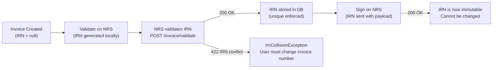

> [!CAUTION]
> Once an invoice is **signed**, the IRN is **immutable**. It cannot be changed, regenerated, or reused. The invoice number that feeds into the IRN must also be locked after signing.

---

## 12. Webhook & Async Handling

The current NRS API is **synchronous** (request → response), but some operations may behave asynchronously in practice:

- **Confirm** — buyer confirmation may be delayed hours/days
- **Transmit** — delivery to the buyer's system may not be instant
- **Future API versions** may introduce webhooks or callbacks

### 12.1 Polling Strategy (Current)

For operations where the result isn't immediate, we poll.

```php
// app/Jobs/PollNrsInvoiceStatus.php

class PollNrsInvoiceStatus implements ShouldQueue
{
    public int $tries = 20;

    public function backoff(): array
    {
        // Poll aggressively at first, then back off
        // 30s, 1m, 2m, 5m, 10m, then every 30m
        return [30, 60, 120, 300, 600, ...array_fill(0, 14, 1800)];
    }

    public function retryUntil(): DateTime
    {
        return now()->addHours(24);  // Poll for up to 24 hours
    }

    public function handle(NrsTransmitService $nrsService): void
    {
        $status = $nrsService->lookupByIrn($this->invoice->irn);

        if ($status->isConfirmed()) {
            // Terminal state reached
            app(InvoiceStateService::class)->transition(
                $this->invoice, 'confirmed', $this->systemUser,
                'nrs_poll', 'Confirmed via polling'
            );
            return;
        }

        if ($status->isFailed()) {
            app(InvoiceStateService::class)->transition(
                $this->invoice, 'transmit_failed', $this->systemUser,
                'nrs_poll', 'NRS reported failure: ' . $status->reason
            );
            return;
        }

        // Still pending — job will be retried via backoff
        $this->release($this->backoff()[$this->attempts() - 1] ?? 1800);
    }
}
```

**When polling is dispatched:**
```php
// After a successful transmit
$stateService->transition($invoice, 'transmitted', ...);

// Start polling for buyer confirmation
PollNrsInvoiceStatus::dispatch($invoice)
    ->delay(now()->addMinutes(5));  // First check after 5 minutes
```

### 12.2 Webhook Endpoint (Prepared)

NRS doesn't currently expose webhooks, but the architecture is ready for when they do.

```php
// routes/api.php
Route::post('/webhooks/nrs', [NrsWebhookController::class, 'handle'])
    ->middleware('verify.nrs.signature');  // HMAC or similar
```

```php
// app/Http/Controllers/Api/NrsWebhookController.php

class NrsWebhookController extends Controller
{
    public function handle(Request $request): JsonResponse
    {
        $event = $request->input('event');     // e.g. 'invoice.confirmed'
        $irn   = $request->input('irn');
        $data  = $request->input('data');

        // Find the invoice
        $invoice = Invoice::where('irn', $irn)->firstOrFail();

        // Dispatch to appropriate handler
        match ($event) {
            'invoice.confirmed'     => $this->handleConfirmation($invoice, $data),
            'invoice.rejected'      => $this->handleRejection($invoice, $data),
            'invoice.payment_updated' => $this->handlePaymentUpdate($invoice, $data),
            default => Log::warning("Unknown NRS webhook event: {$event}"),
        };

        return response()->json(['status' => 'received'], 200);
    }
}
```

### 12.3 Design Decisions

| Concern | Approach |
|---|---|
| **Confirmation polling** | `PollNrsInvoiceStatus` job dispatched after transmit, backs off exponentially over 24h |
| **Webhook readiness** | Route + controller scaffold exists but middleware (`verify.nrs.signature`) returns 404 until NRS publishes webhook docs |
| **Idempotent webhook processing** | Use `idempotency_key` = `webhook_{event}_{irn}_{timestamp}` to prevent duplicate processing |
| **State transitions from async** | Same `InvoiceStateService` used — no special path. `trigger` field records `nrs_poll` or `nrs_webhook` |

> [!TIP]
> The `trigger` field on `invoice_state_transitions` distinguishes how a state change happened: `manual`, `nrs_validate`, `nrs_sign`, `nrs_transmit`, `nrs_poll`, `nrs_webhook`. This makes debugging async flows straightforward.

## 13. Current Implementation Status

> [!WARNING]
> This architecture document describes the **complete target state**. Many components are documented but **not yet implemented**. This section tracks what exists in the codebase as of **April 2026**.

### 13.1 Backend — Implementation Matrix

#### Controllers (`app/Http/Controllers/Api/`)

| File | Documented | Exists | Notes |
|---|---|---|---|
| `AuthController.php` | ✅ | ✅ | Login, register, logout, me |
| `DashboardController.php` | ✅ | ✅ | |
| `InvoiceController.php` | ✅ | ✅ | Full CRUD + NRS actions |
| `CustomerController.php` | ✅ | ✅ | |
| `ProductController.php` | ✅ | ✅ | |
| `OrganizationController.php` | ✅ | ✅ | |
| `NrsController.php` | ✅ | ❌ | Not created — NRS actions live on InvoiceController |
| `NrsResourceController.php` | ✅ | ✅ | |
| `ActivityLogController.php` | ✅ | ✅ | |
| `ReportController.php` | ✅ | ✅ | |
| `SuperAdminController.php` | ✅ | ❌ | Phase 6 |
| `TeamController.php` | ❌ | ✅ | Exists but not in original architecture doc |
| `OnboardingController.php` | ❌ | ✅ | Exists but not in original architecture doc |
| `NrsWebhookController.php` | ✅ | ✅ | Scaffold only |

#### Middleware

| File | Location | Documented | Exists | Notes |
|---|---|---|---|---|
| `EnsureOrganizationScope.php` | `Http/Middleware/` | ✅ | ✅ | |
| `LogUserActivity.php` | `Http/Middleware/` | ✅ | ❌ | Not created |
| `EnsureIdempotencyKey.php` | `app/Middleware/` | ✅ | ❌ | Not created |
| `EnsureSuperAdmin.php` | Both | ✅ | ❌ | Phase 6 |

#### Models (`app/Models/`)

| File | Documented | Exists | Notes |
|---|---|---|---|
| `User.php` | ✅ | ✅ | Missing `is_super_admin` column |
| `Organization.php` | ✅ | ✅ | |
| `Invoice.php` | ✅ | ✅ | |
| `InvoiceLine.php` | ✅ | ✅ | |
| `InvoiceTaxTotal.php` | ✅ | ✅ | |
| `InvoiceAllowanceCharge.php` | ✅ | ✅ | |
| `InvoicePaymentMeans.php` | ✅ | ✅ | |
| `InvoiceDocReference.php` | ✅ | ✅ | |
| `InvoiceStateTransition.php` | ✅ | ✅ | |
| `Customer.php` | ✅ | ✅ | |
| `Product.php` | ✅ | ✅ | |
| `NrsSubmission.php` | ✅ | ✅ | |
| `ActivityLog.php` | ✅ | ✅ | |
| `NrsApiLog.php` | ❌ | ✅ | Exists but not in architecture doc |

#### DTOs (`app/DTOs/`)

| Directory | Documented | Exists | Notes |
|---|---|---|---|
| `Invoice/` (8 files) | ✅ | ✅ | All 8 Invoice DTOs exist |
| `Auth/` (2 files) | ✅ | ✅ | LoginDTO, RegisterDTO |
| `Customer/` | ✅ | ❌ | Not created |
| `Product/` | ✅ | ❌ | Not created |
| `Nrs/` (11 files) | ✅ | ❌ | NRS-specific payload DTOs not created — payload built directly in `NrsPayloadBuilder` |

#### Services (`app/Services/`)

| File | Documented | Exists | Notes |
|---|---|---|---|
| `InvoiceService.php` | ✅ | ✅ | |
| `InvoiceStateService.php` | ✅ | ✅ | |
| `CustomerService.php` | ✅ | ✅ | |
| `ProductService.php` | ✅ | ✅ | Minimal |
| `ActivityLogService.php` | ✅ | ✅ | |
| `DashboardService.php` | ✅ | ✅ | |
| `InvoicePdfService.php` | ❌ | ✅ | Exists but not in architecture doc |
| `IdempotencyService.php` | ✅ | ❌ | Not created |

#### NRS Services (`app/Services/Nrs/`)

| File | Documented | Exists | Notes |
|---|---|---|---|
| `NrsClient.php` | ✅ | ✅ | |
| `NrsInvoiceService.php` | ✅ | ✅ | Synchronous — no queue dispatch |
| `NrsPayloadBuilder.php` | ✅ | ✅ | |
| `NrsResourceService.php` | ✅ | ✅ | |
| `NrsAuthService.php` | ✅ | ❌ | Not created |
| `NrsEntityService.php` | ✅ | ❌ | Not created |
| `NrsTransmitService.php` | ✅ | ❌ | Transmit logic lives in `NrsInvoiceService` |
| `NrsIrnGenerator.php` | ✅ | ❌ | IRN generation lives in `NrsPayloadBuilder` |

#### Jobs (`app/Jobs/`)

| File | Documented | Exists | Notes |
|---|---|---|---|
| **Entire directory** | ✅ | ❌ | **Directory does not exist** |
| `ValidateInvoiceOnNrs.php` | ✅ | ❌ | All NRS calls are synchronous |
| `SignInvoiceOnNrs.php` | ✅ | ❌ | |
| `TransmitInvoiceOnNrs.php` | ✅ | ❌ | |
| `ResolveStuckPendingInvoices.php` | ✅ | ❌ | Similar `RecoverStuckInvoices` exists as Artisan command |
| `SyncNrsResources.php` | ✅ | ❌ | |
| `PollNrsInvoiceStatus.php` | ✅ | ❌ | Similar `PollNrsConfirmations` exists as Artisan command |

> [!IMPORTANT]
> **No queue-based NRS processing exists.** All NRS API calls (validate, sign, transmit, confirm) execute **synchronously** in the HTTP request cycle via `NrsInvoiceService`. The retry/backoff strategy documented in §10 is entirely unimplemented. Two related Artisan commands exist: `RecoverStuckInvoices` and `PollNrsConfirmations`.

#### Events (`app/Events/`)

| File | Documented | Exists | Notes |
|---|---|---|---|
| **Entire directory** | ✅ | ❌ | **Directory does not exist** |
| `InvoiceCreated.php` | ✅ | ❌ | |
| `InvoiceUpdated.php` | ✅ | ❌ | |
| `InvoiceStatusChanged.php` | ✅ | ❌ | |
| `InvoiceValidated.php` | ✅ | ❌ | |
| `InvoiceSigned.php` | ✅ | ❌ | |
| `InvoiceTransmitted.php` | ✅ | ❌ | |
| `InvoiceConfirmed.php` | ✅ | ❌ | |
| `InvoicePaymentUpdated.php` | ✅ | ❌ | |

#### Listeners (`app/Listeners/`)

| File | Documented | Exists | Notes |
|---|---|---|---|
| **Entire directory** | ✅ | ❌ | **Directory does not exist** |
| `RecordStateTransition.php` | ✅ | ❌ | State transitions recorded directly in `InvoiceStateService` |
| `RecordActivityLog.php` | ✅ | ❌ | Activity logged directly in controllers |
| `RecordNrsSubmission.php` | ✅ | ❌ | Submissions recorded directly in `NrsInvoiceService` |

#### Enums (`app/Enums/`)

| File | Documented | Exists | Notes |
|---|---|---|---|
| `InvoiceStatus.php` | ✅ | ✅ | |
| `PaymentStatus.php` | ✅ | ✅ | |
| `InvoiceTypeCode.php` | ✅ | ✅ | |
| `NrsAction.php` | ✅ | ✅ | |
| `NrsSubmissionStatus.php` | ✅ | ✅ | |
| `ActivityAction.php` | ✅ | ✅ | |
| `DocReferenceType.php` | ✅ | ✅ | |
| `UserRole.php` | ✅ | ❌ | Phase 6 |

#### Exceptions (`app/Exceptions/`)

| File | Documented | Exists | Notes |
|---|---|---|---|
| `NrsApiException.php` | ✅ | ✅ | |
| `NrsConnectionException.php` | ✅ | ✅ | |
| `InvoiceStateException.php` | ✅ | ✅ | |
| `NrsValidationException.php` | ✅ | ❌ | |
| `NrsRateLimitException.php` | ✅ | ❌ | |
| `IdempotencyConflictException.php` | ✅ | ❌ | |
| `IrnCollisionException.php` | ✅ | ❌ | |
| `Handler.php` | ✅ | ❌ | |

#### Policies (`app/Policies/`)

| File | Documented | Exists | Notes |
|---|---|---|---|
| **Entire directory** | ✅ | ❌ | **Directory does not exist** |
| `InvoicePolicy.php` | ✅ | ❌ | Phase 6 |
| `CustomerPolicy.php` | ✅ | ❌ | Phase 6 |
| `OrganizationPolicy.php` | ✅ | ❌ | Phase 6 |

#### Providers (`app/Providers/`)

| File | Documented | Exists | Notes |
|---|---|---|---|
| `AppServiceProvider.php` | ✅ | ✅ | |
| `NrsServiceProvider.php` | ✅ | ❌ | NRS services registered in AppServiceProvider |

#### Console Commands (`app/Console/Commands/`)

| File | Documented | Exists | Notes |
|---|---|---|---|
| `MakeSuperAdmin.php` | ✅ | ❌ | Phase 6 |
| `RecoverStuckInvoices.php` | ❌ | ✅ | Not in architecture doc |
| `PollNrsConfirmations.php` | ❌ | ✅ | Not in architecture doc |

#### Form Requests (`app/Http/Requests/`)

| Directory / File | Documented | Exists | Notes |
|---|---|---|---|
| `Auth/LoginRequest.php` | ✅ | ✅ | |
| `Auth/RegisterRequest.php` | ✅ | ✅ | |
| `Invoice/StoreInvoiceRequest.php` | ✅ | ✅ | |
| `Invoice/UpdateInvoiceRequest.php` | ✅ | ❌ | |
| `Invoice/ValidateInvoiceOnNrsRequest.php` | ✅ | ❌ | |
| `Invoice/SignInvoiceOnNrsRequest.php` | ✅ | ❌ | |
| `Invoice/TransmitInvoiceRequest.php` | ✅ | ❌ | |
| `Invoice/UpdatePaymentStatusRequest.php` | ✅ | ❌ | |
| `Invoice/SearchInvoiceRequest.php` | ✅ | ❌ | |
| `Customer/StoreCustomerRequest.php` | ✅ | ✅ | |
| `Customer/UpdateCustomerRequest.php` | ✅ | ✅ | |
| `Product/StoreProductRequest.php` | ✅ | ✅ | |
| `Product/UpdateProductRequest.php` | ✅ | ✅ | |
| `Organization/UpdateOrganizationRequest.php` | ✅ | ✅ | |
| `Organization/InviteMemberRequest.php` | ✅ | ❌ | Team invite uses `Team/AddMemberRequest` instead |
| `Team/AddMemberRequest.php` | ❌ | ✅ | Not in architecture doc |

#### API Resources (`app/Http/Resources/`)

| File | Documented | Exists | Notes |
|---|---|---|---|
| `InvoiceResource.php` | ✅ | ✅ | |
| `InvoiceDetailResource.php` | ✅ | ✅ | |
| `CustomerResource.php` | ✅ | ✅ | |
| `ProductResource.php` | ✅ | ✅ | |
| `DashboardResource.php` | ✅ | ✅ | |
| `InvoiceLineResource.php` | ✅ | ❌ | |
| `NrsSubmissionResource.php` | ✅ | ❌ | |
| `InvoiceTimelineResource.php` | ✅ | ❌ | |
| `ActivityLogResource.php` | ✅ | ❌ | |

---

### 13.2 Frontend — Implementation Matrix

#### API Modules (`src/api/`)

| File | Documented | Exists | Notes |
|---|---|---|---|
| `client.ts` | ✅ | ✅ | |
| `auth.ts` | ✅ | ✅ | |
| `invoices.ts` | ✅ | ✅ | |
| `customers.ts` | ✅ | ✅ | |
| `products.ts` | ✅ | ✅ | |
| `dashboard.ts` | ✅ | ✅ | |
| `nrs.ts` | ✅ | ❌ | NRS calls routed through `invoices.ts` |
| `reports.ts` | ✅ | ✅ | |
| `activity-logs.ts` | ✅ | ✅ | |
| `organization.ts` | ✅ | ✅ | |
| `resources.ts` | ❌ | ✅ | Not in architecture doc |
| `team.ts` | ❌ | ✅ | Not in architecture doc |

#### Hooks (`src/hooks/`)

| File | Documented | Exists | Notes |
|---|---|---|---|
| `useAuth.ts` | ✅ | ✅ | Named `use-auth.ts` |
| `useInvoices.ts` | ✅ | ❌ | |
| `useInvoiceTimeline.ts` | ✅ | ❌ | |
| `useInvoiceSubmissions.ts` | ✅ | ❌ | |
| `useActivityLogs.ts` | ✅ | ❌ | |
| `useCustomers.ts` | ✅ | ❌ | |
| `useProducts.ts` | ✅ | ❌ | |
| `useDashboard.ts` | ✅ | ❌ | |
| `useNrsResources.ts` | ✅ | ❌ | |
| `useDebounce.ts` | ✅ | ❌ | |
| `use-mobile.ts` | ❌ | ✅ | Not in architecture doc |
| `use-sidebar.tsx` | ❌ | ✅ | Not in architecture doc |

#### Contexts (`src/contexts/`)

| File | Documented | Exists | Notes |
|---|---|---|---|
| `AuthContext.tsx` | ✅ | ✅ | Also has `AuthContextInstance.ts` |
| `OrganizationContext.tsx` | ✅ | ❌ | |
| `ThemeContext.tsx` | ✅ | ❌ | |

#### Pages (`src/pages/`)

| File | Documented | Exists | Notes |
|---|---|---|---|
| `auth/LoginPage.tsx` | ✅ | ✅ | |
| `auth/RegisterPage.tsx` | ✅ | ✅ | |
| `auth/ForgotPasswordPage.tsx` | ✅ | ❌ | |
| `dashboard/DashboardPage.tsx` | ✅ | ✅ | |
| `invoices/InvoiceListPage.tsx` | ✅ | ✅ | |
| `invoices/InvoiceCreatePage.tsx` | ✅ | ✅ | |
| `invoices/InvoiceEditPage.tsx` | ✅ | ❌ | |
| `invoices/InvoicePreviewPage.tsx` | ✅ | ❌ | Preview is inline in create flow |
| `invoices/InvoiceDetailPage.tsx` | ✅ | ✅ | |
| `customers/CustomerListPage.tsx` | ✅ | ✅ | Located in `customers/` |
| `customers/CustomerDetailPage.tsx` | ✅ | ❌ | |
| `products/ProductListPage.tsx` | ✅ | ✅ | Located in `products/` |
| `reports/ReportsPage.tsx` | ✅ | ❌ | `ReportB2CPage.tsx` exists in `dashboard/` instead |
| `activity/ActivityLogPage.tsx` | ✅ | ✅ | Located in `dashboard/` |
| `settings/OrganizationSettingsPage.tsx` | ✅ | ✅ | |
| `settings/NrsConfigPage.tsx` | ✅ | ❌ | |
| `settings/TeamMembersPage.tsx` | ✅ | ✅ | Named `TeamManagementPage.tsx` |
| `settings/ProfilePage.tsx` | ✅ | ❌ | |
| `admin/*` (5 pages) | ✅ | ❌ | Phase 6 |

#### Components (`src/components/`)

| Directory | Documented | Exists | Notes |
|---|---|---|---|
| `ui/` | ✅ | ✅ | shadcn/ui primitives |
| `errors/` (7 files) | ✅ | ❌ | Error boundaries not created |
| `layout/` | ✅ | ✅ | `AppLayout`, `AppSidebar`, `AuthLayout`, `PageHeader` |
| `invoices/` (16+ files) | ✅ | ❌ | Invoice form components not in `components/` — embedded in pages |
| `invoices/preview/` (8 files) | ✅ | ❌ | Preview components not created |
| `dashboard/` (4 files) | ✅ | ❌ | Dashboard widgets embedded in `DashboardPage` |
| `activity/` | ✅ | ❌ | |
| `customers/` | ✅ | ❌ | |
| `guards/` | ✅ | ❌ | Phase 6 |
| `shared/` (6 files) | ✅ | ❌ | |
| `common/` | ❌ | ✅ | Contains `Logo.tsx` — not in architecture doc |

#### Types (`src/types/`)

| File | Documented | Exists | Notes |
|---|---|---|---|
| `auth.ts` | ✅ | ✅ | |
| `invoice.ts` | ✅ | ❌ | Types defined inline in API modules |
| `customer.ts` | ✅ | ❌ | |
| `product.ts` | ✅ | ❌ | |
| `nrs.ts` | ✅ | ❌ | |
| `timeline.ts` | ✅ | ❌ | |
| `activity.ts` | ✅ | ❌ | |
| `organization.ts` | ✅ | ❌ | |
| `admin.ts` | ✅ | ❌ | Phase 6 |
| `api.ts` | ✅ | ❌ | |

#### Lib (`src/lib/`)

| File | Documented | Exists | Notes |
|---|---|---|---|
| `utils.ts` | ✅ | ✅ | |
| `formatters.ts` | ✅ | ❌ | |
| `validators.ts` | ✅ | ❌ | |
| `constants.ts` | ✅ | ❌ | |

---

### 13.3 Key Architectural Gaps

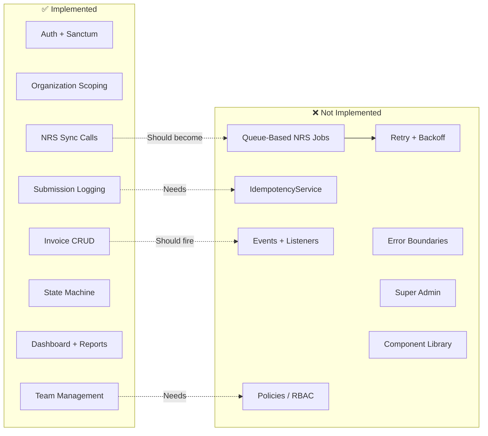

| Gap | Impact | Priority |
|---|---|---|
| **No queue jobs** | NRS calls block HTTP requests; timeouts cause 500s to users | 🔴 Critical |
| **No retry/backoff** | Failed NRS calls require manual retry; no automatic recovery | 🔴 Critical |
| **No IdempotencyService** | Duplicate submissions possible on network retries | 🔴 Critical |
| **No events/listeners** | Tight coupling — state changes, logging, and submissions are all inline | 🟡 High |
| **No error boundaries** | Frontend crashes propagate to full-page errors | 🟡 High |
| **No Policies/RBAC** | Role column exists on pivot but never enforced server-side | 🟢 Medium |
| **No super admin** | Platform management requires direct DB access | 🟢 Medium |
| **No component extraction** | Dashboard widgets, invoice form sections embedded in pages — not reusable | 🟢 Medium |

---

## 14. Development Phases

| Phase | Scope | Priority |
|---|---|---|
| **Phase 1** | Auth + Organization + full DB migrations + DTOs + API scaffold + Frontend layout/routing + Error boundaries | 🔴 Critical |
| **Phase 2** | Invoice CRUD (local) + **Preview UI** + Customer + Product + State timeline + Activity logs | 🔴 Critical |
| **Phase 3** | NRS Integration — Validate → Sign → Transmit → Confirm + Idempotency + Retry/backoff + Submission logging | 🔴 Critical |
| **Phase 4** | Dashboard + analytics + NRS health + Confirmation polling + Activity log page | 🟡 High |
| **Phase 5** | Invoice download/PDF + Payment status updates + Reports | 🟡 High |
| **Phase 6** | Team management + RBAC + Organization settings + **Super Admin** (platform roles, `is_super_admin` flag, admin panel, cross-org access, `EnsureSuperAdmin` middleware, Artisan promote command) | 🟢 Medium |
| **Phase 7** | Stuck invoice recovery, webhook endpoint, circuit breaker, error tracking, B2C reporting | 🟢 Medium |

